# test0x01-xss
xss漏洞平台搭建并利用  

## 实验环境
windows+apache+php  
[在 Windows 下安装、配置 Apache 2.4 和 PHP 7 ](https://ntflc.com/2017/06/04/Install-Apache-and-PHP-on-Windows/)
## 实验步骤

### 一、编写一个简单的xss.html,本次实验代码如下。
* 注意编码格式
>code/xss.html
```
<html>
<body>
<form method="post">
        <input type="text">
        <button>提交</button>
      </form>
</body>
</html>
```
.html文件打开结果如下图
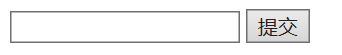

### 二、搭建web服务器并启动
* [apache haus下载](https://www.apachehaus.com/cgi-bin/download.plx)  
此次实现选用Apache 2.4 VC15
* [apache安装教程](https://www.cnblogs.com/wcwnina/p/8044353.html) 

1. 设置web服务器，更改apache安装位置为绝对路径以及使用80端口
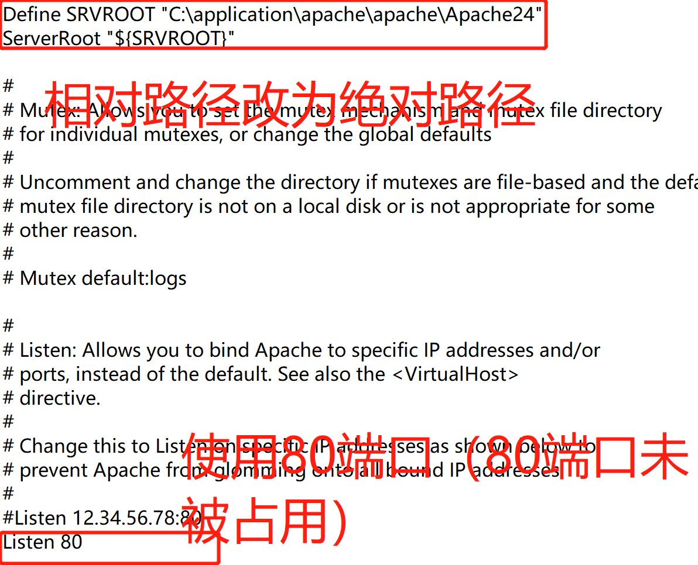
* [如何检查端口占用以及如何解除被占用端口](https://blog.csdn.net/NANGE_BOK/article/details/84870460) 
2. 管理员权限进入bin目录下安装
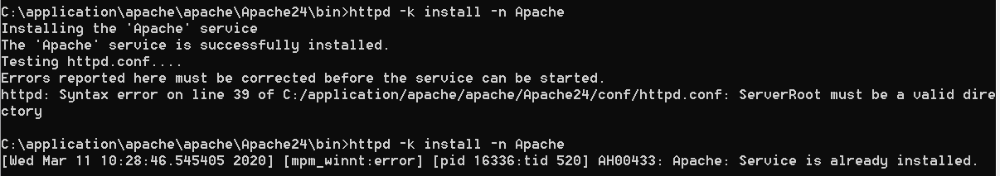
* 第一次安装时的报错是更改绝对路径疏忽出错，发现后已解决
3. 启动apache。  
方式有三种：  
1)打开'计算机管理'---'服务'---'apache'右键单击'启动'  
2)命令行方式启动
```
httpd -k start  启动服务
httpd -k stop   停止服务
httpd -k restart    重启服务
httpd -v   查看apache服务版本号
httpd -help  查看帮助 
```
* 进入bin目录或将bin目录添加到环境变量
<<<<<<< Updated upstream
3)'bin'目录下打开'ApacheMonitor.exe'
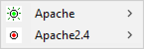
=======

3)'bin'目录下打开'ApacheMonitor.exe'  
  
>>>>>>> Stashed changes
4. 网页中输入网址'http://localhost'。如下图所示，由于'htdocs'文件夹下已有自带的index.html（效果如下图所示），说明基本配置完毕。
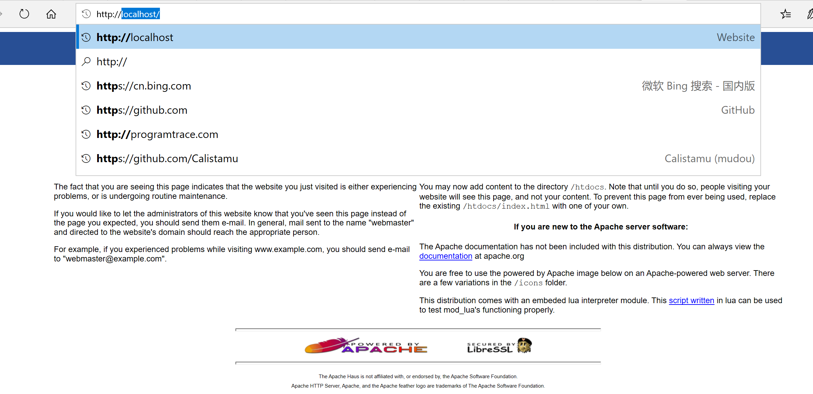

* 将写好的.html或.php文件放入htdocs,或如下图所示，更改文件路径。
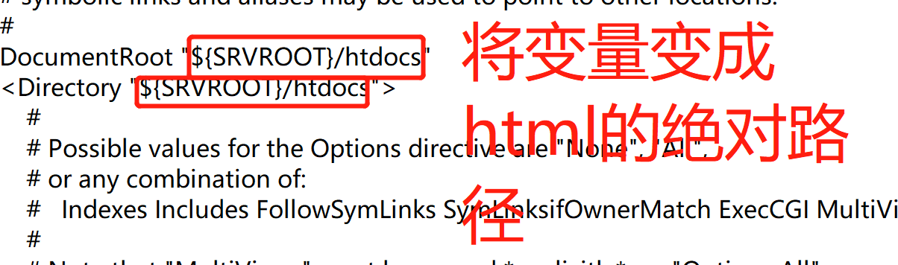

5. 将已写好的xss.html放入htdocs文件夹,访问'http://localhost/xss.html'发现与我们之前所写的网页效果一样，前端搞定。
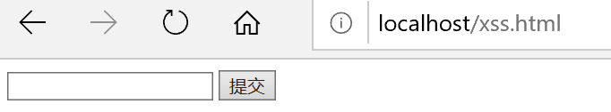
发现输入```<script>alert('xss')</script>```提交后只是刷新，因为后端没有收到提交的数据并反馈一个结果，还需要后端的处理。
### 三、 下载安装php并将其与apache配置
1. [php下载并解压](http://windows.php.net/download/)
* apache的版本要与php的版本相同，本次实验都是VC15
* TS与NTS区别：下载页面左侧有介绍。简言之：：若使用的是PHP的FastCGI IIS，选择NTS。使用Apache，您必须使用Thread Safe（TS）版本的PHP。此次实验选择TS，如果没有选择TS，很明显.zip解压以后没有php7apache2_4.dll
2. 由于后续 WebPageTest 的需要，[下载 APC](http://pecl.php.net/package/APCu)，解压后拷贝php_apcu.dll到'php/ext'文件夹下
3. 'php'文件夹下，重命名php.ini-development为php.ini。如下修改：    
1）; extension_dir = "ext"为extension_dir = "...php7/ext"（ext绝对路径）  
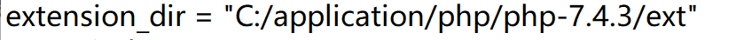
2）需要的扩展去掉';',并且添加我们自己下载的php_apcu.dll
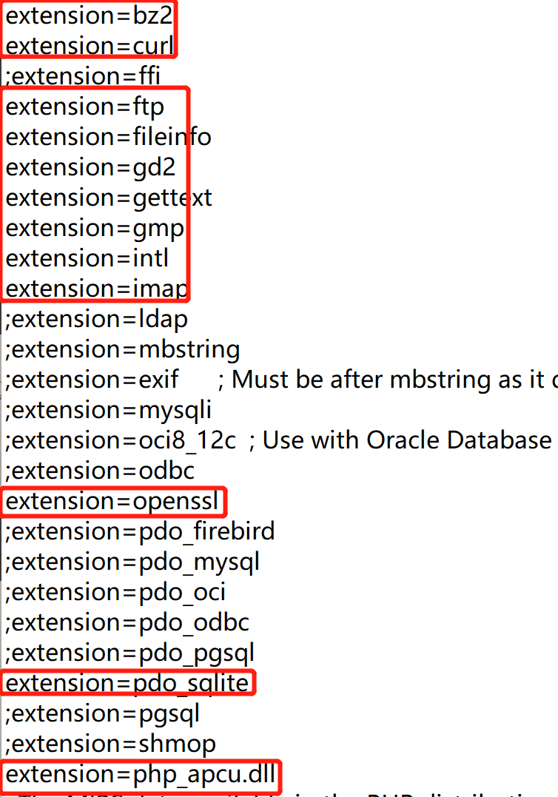
4. 添加php模块:在Apache配置文件中，很多'#LoadModulexxx'后添加```PHPIniDir "php文件夹路径"```和```LoadModule php7_module "php文件夹路径/php7apache2_4.dll"```
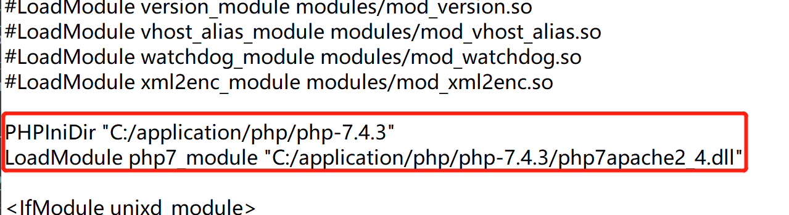
5. 添加php文件后缀:在Apache配置文件中，IfModule mime_module与/IfModule标签之间，添加```AddType application/x-httpd-php .php```
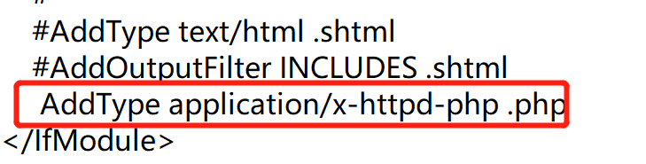
6. (这一步只是决定了主页，是否操作没太大影响)将index.php设置在index.html前
```
<IfModule dir_module>
    DirectoryIndex index.php index.html
</IfModule>
```
再次访问'http://localhost'，看到php与apache配置完成。如果没有进行第六步操作，则访问‘http://localhost/index.php'
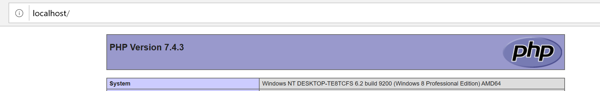
### 四、xss漏洞利用
xss.php代码如下
>code/xss.php
```
<html>
<head> 
<meta http-equiv="Content-Type" content="text/html; charset=utf-8" /> 
<title>XSS</title> 
</head> 
<body> 
<form action="" method="get"> 
<input type="text" name="input">     
<input type="submit"> 
</form> 
<br> 
<?php 
$XssReflex = $_GET['input'];
echo 'output:<br>'.$XssReflex;
?> 
</body> 
</html>
```
访问网页，输入任意数据，就有了反馈结果，如下图
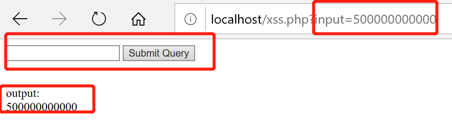
输入漏洞测试语句```<script>alert('xss')</script>```结果如下图所示
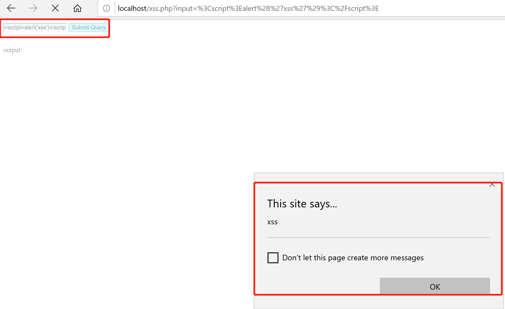
## 实验效果
>video/xss漏洞搭建及利用平台.mp4  
[在线视频](https://www.bilibili.com/video/av95722607)
## 第二种实验方法：vs code 调试运行.php文件
* 参考[如何在vscode配置php开发环境](https://blog.csdn.net/summer2day/article/details/78534352)  
### 实验环境
win10+vscode
### 实验步骤
具体实验过程和效果：
>video/xss漏洞搭建及利用平台-改进版.mp4  
[在线视频](https://www.bilibili.com/video/av97632428)  
视频中缺漏：  
1. 在vs code的setting.json中添加php的路径：  
“php.validate.executablePath”: “D:/xampp/php/php.exe” 
2. vs code安装完成后下载php debug插件

## 第三种实验方法：更轻量级地web服务器和更方便的配置
* 参考[How To Install Linux, Nginx, MySQL, PHP (LEMP stack) in Ubuntu 16.04](https://www.digitalocean.com/community/tutorials/how-to-install-linux-nginx-mysql-php-lemp-stack-in-ubuntu-16-04)
* 由于本次xss依然使用Php超级变量，是反射型xss，没有用到mysql，因此没有进行mysql的安装
### 实验环境
ubuntu16.04-desktop-x64+nginx+php
### 实验步骤
1. 安装nginx
```
apt-get update
apt-get install nginx
```
访问'http:localhost:80/'看到nginx的页面，安装成功  
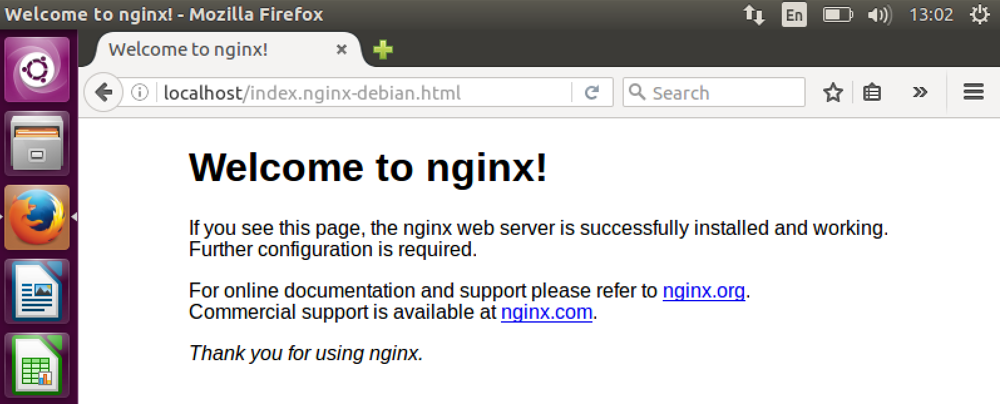
2. 安装php
```
apt-get install php-fpm php-mysql
```
3. 配置Nginx使用PHP
* 参考[Serve PHP with PHP-FPM and NGINX](https://www.linode.com/docs/web-servers/nginx/serve-php-php-fpm-and-nginx/)
```
# 修改nginx配置文件
vim /etc/nginx/sites-available/default
```
更改如下图：  
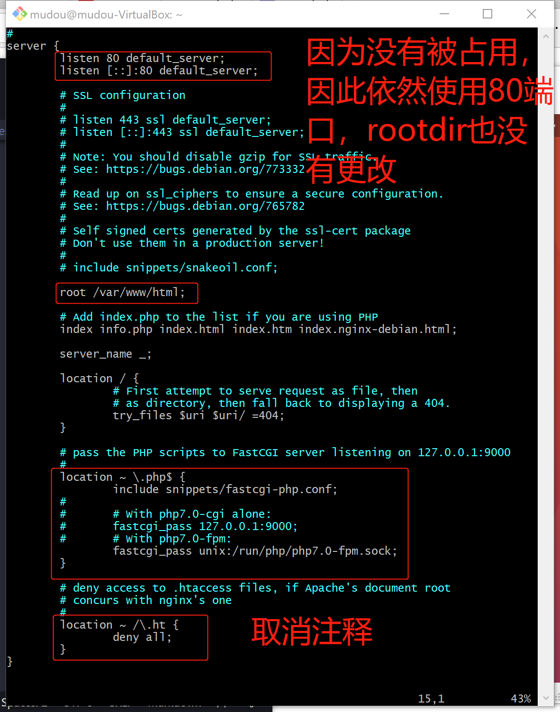
```
# 检查文件有没有错误
sudo nginx -t
# 重启nginx
/etc/init.d/nginx restart

# 增加测试info.php
vim /var/www/html/info.php
# 代码如下
<?php 
phpinfo();
?>
```
访问页面看到：  
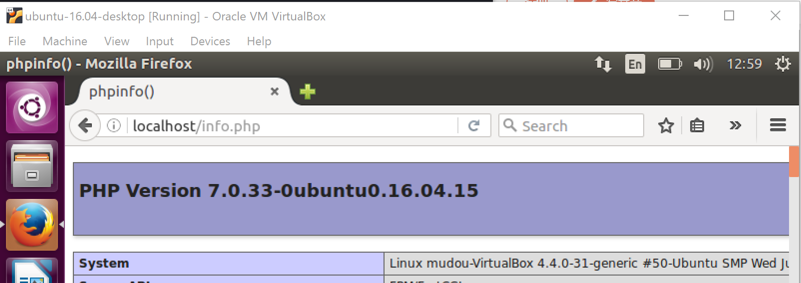
4. 将xss.php放到/var/www/html/文件夹下，再次访问
```
# 安装ssh
sudo apt-get install openssh-server
# 修改配置文件/etc/ssh/sshd_config
vi /etc/ssh/sshd_config
```
看到xss.php的内容：  
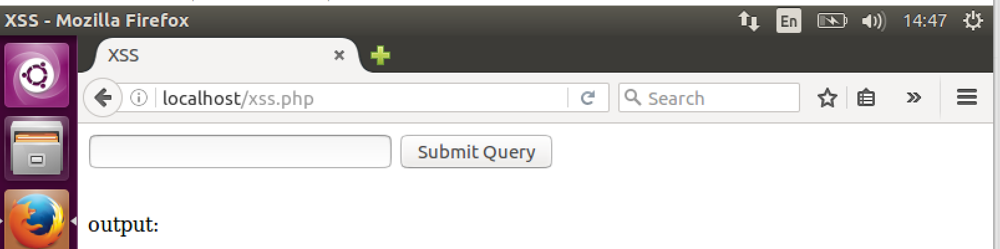  
输入```<script>alert('xss')</script>```，出现了弹窗，实验成功。  
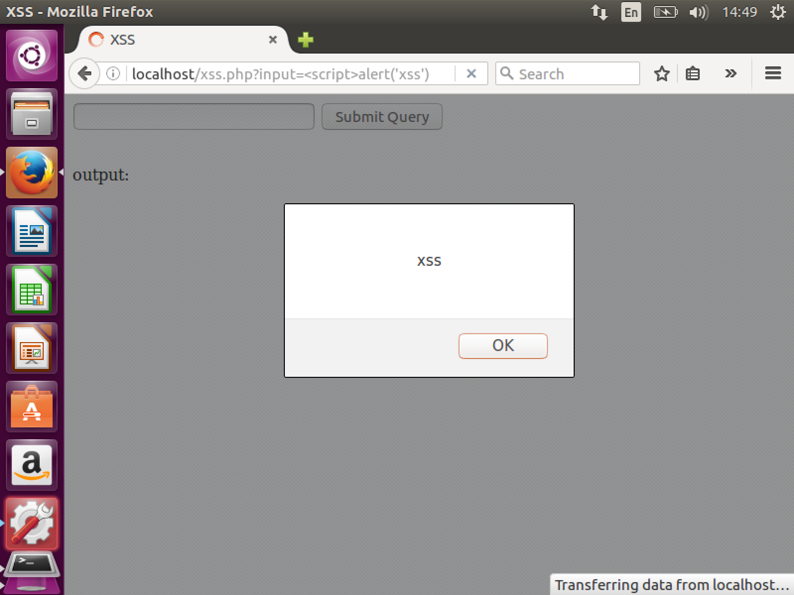  
### 实验效果
>video/xss漏洞搭建及利用平台-改进再改进版.mp4  
## 实验问题
1. 【第一种方法】Php版本如果下错了的话没有php7apache2_4.dll  
分析解决：php的版本应该与apache的版本相对应   
2. 【第三种方法】使用scp拷贝xss.php时出现报错：'Permission Denied'  
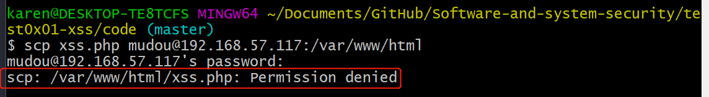  
解决：```sudo chmod 777 /var/www/html```之后再ssh  
* Chmod 777 (chmod a+rwx) sets permissions so that, (U)ser / owner can read, can write and can execute. (G)roup can read, can write and can execute. (O)thers can read, can write and can execute.
* Chmod 754 (chmod a+rwx,g-w,o-wx) sets permissions so that, (U)ser / owner can read, can write and can execute. (G)roup can read, can't write and can execute. (O)thers can read, can't write and can't execute.
## 实验总结
1. 对于工具的选用总结。  
* 首先，应该广泛使用各种工具，熟悉基本操作，对比各个工具的特点。(目前自己用过的还比较少)
* 其次，应该根据自己的实验的需求进行适当的选择。本次实验，第一次实验方法的工具就显得重量级，方法步骤都比较麻烦。
2. 对于自我学习的反思总结：  
* 不应该图轻松吃别人咀嚼过的食物，虽然官方文档的成长路有些漫长，却是最好的选择，所有的配置和操作都有理有据。(这里解决了，从前学习的时候总想问为什么要这样操作的问题。所有的操作并不是凭空想象，全都有理有据。)  
* 读官方文档应该逐字逐句，我的缺点是跳跃阅读。  
* 应该回顾，反思总结实验过程。不然演示的时候，自己就挂在那里。
* 应该勇敢地表达自己知道或不知道。
## 参考文献
[在 Windows 下安装、配置 Apache 2.4 和 PHP 7 ](https://ntflc.com/2017/06/04/Install-Apache-and-PHP-on-Windows/)   
[如何在vscode配置php开发环境](https://blog.csdn.net/summer2day/article/details/78534352)   
[建站教程（三）：在Ubuntu上配置Nginx+MySQL+PHP7](https://zhuanlan.zhihu.com/p/37593436)   
[Serve PHP with PHP-FPM and NGINX](https://www.linode.com/docs/web-servers/nginx/serve-php-php-fpm-and-nginx/)   
[Chmod 754](https://chmodcommand.com/chmod-754/)  
[Chmod 777](https://chmodcommand.com/chmod-777/)