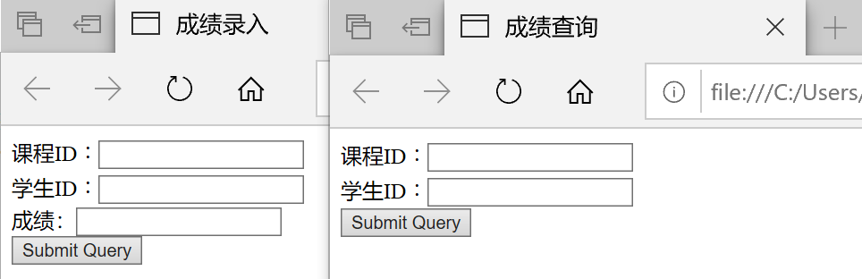
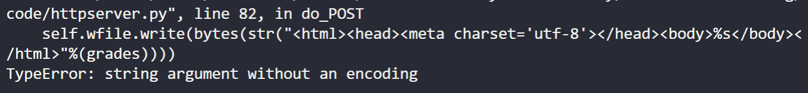

# web开发
## 实验要求

- [x] [使用更底层的pyhton的sqlite库来编程操作数据库](https://docs.python.org/3/library/sqlite3.html)。
- [x] httpserver.py的基础上，写两个页面：教师录入成绩页面和学生查询成绩页面。  
教师录入成绩页面表单有三个字段，课程id，学生id，成绩。
- [x] 录入提交以后，httpserver调用sqlite库使用sql语句写入数据库。然后是学生查询成绩表单，学生输入学生id，课程id，httpserver使用sql语句查询成绩后返回给用户。  
* 这里不需要做登录功能，课程也用直接输入id而不是下拉菜单的方式，或者其他选择的方式，而是直接输入id。为了体验最原始的web的开发过程。  

## 实验过程

1. 准备数据库并建表。
```
sqlite3 edu.db
create table studentsinfo(course_id INTEGER,student_id INTEGER,grades INTEGER);
```

2. 编写html代码。
>code/insert.html是成绩录入页面
>code/select.html是成绩查询页面


3. 更改httpserver.py实现成绩录入和成绩查询。
>code/httpserver.py是服务器代码
## 实验效果

## 实验问题
在查询数据后进行显示时，数据显示报错搞了很久，报错信息如下图所示。
  
[解决办法](https://www.e-learn.cn/topic/3001956)
## 实验参考
[sqlite教程](https://docs.python.org/3/library/sqlite3.html)  
[httpserver教程](https://docs.python.org/3/library/http.server.html)  
[MP4-to-gif-在线网站](https://ezgif.com/video-to-gif)