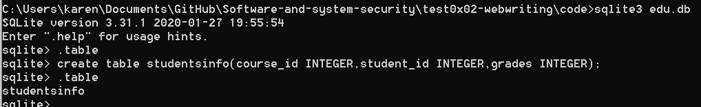

# web开发
## 实验要求

- [x] [使用更底层的pyhton的sqlite库来编程操作数据库](https://docs.python.org/3/library/sqlite3.html)。
- [x] httpserver.py的基础上，写两个页面：教师录入成绩页面和学生查询成绩页面。  
教师录入成绩页面表单有三个字段，课程id，学生id，成绩。
- [x] 录入提交以后，httpserver调用sqlite库使用sql语句写入数据库。然后是学生查询成绩表单，学生输入学生id，课程id，httpserver使用sql语句查询成绩后返回给用户。  
* 这里不需要做登录功能，课程也用直接输入id而不是下拉菜单的方式，或者其他选择的方式，而是直接输入id。为了体验最原始的web的开发过程。  

## 实验过程

1. 准备数据库并建表。
* [sqlite](https://www.sqlite.org/index.html)
```
sqlite3 edu.db
create table studentsinfo(course_id INTEGER,student_id INTEGER,grades INTEGER);
```

2. 编写html代码。
>code/insert.html是成绩录入页面  
>code/select.html是成绩查询页面


3. 更改httpserver.py实现成绩录入和成绩查询。
>code/httpserver.py是更改后的服务器代码
>code/httpserver-copy.py是老师的未更改代码
## 实验效果
>video/web开发演示效果.mp4  

>video/web-my.mp4是完整的我的实验过程

[我的实验演示在线视频](https://www.bilibili.com/video/BV1aQ4y1P7GE/)

* gif展示的效果不清晰，因此mp4文件保留  

>video/web开发教师实验重复.mp4顾名思义

[教师实验重复在线视频](https://www.bilibili.com/video/BV1hv411q76y)
## 实验问题
在查询数据后进行显示时，数据显示报错搞了很久，报错信息如下图所示。
  
[解决办法](https://www.e-learn.cn/topic/3001956)
## 实验总结
### 服务器 vs 框架
  - 参考:
     - [从零开始搭建论坛（一）：Web服务器与Web框架](https://selfboot.cn/2016/07/28/forum_design_framework/#Web-%E6%A1%86%E6%9E%B6)
     - [Model–view–controller](https://en.wikipedia.org/wiki/Model%E2%80%93view%E2%80%93controller)  
     - [Web framework](https://en.wikipedia.org/wiki/Web_framework)
     - [Web服务器网关接口](https://zh.wikipedia.org/wiki/Web%E6%9C%8D%E5%8A%A1%E5%99%A8%E7%BD%91%E5%85%B3%E6%8E%A5%E5%8F%A3)
     - [CGI](https://en.wikipedia.org/wiki/Common_Gateway_Interface)

WSGI是web服务器端（服务器或网关）和应用程序端（应用程序或应用框架）之间的低级别接口。

  - WSGI 中间件同时实现了API的两方，因此可以在WSGI服务器和WSGI应用之间起调解作用：从Web服务器的角度来说，中间件扮演应用程序，而从应用程序的角度来说，中间件扮演服务器。


对于原始的web开发，比如Python使用CGI标准，服务器支持CGI和配置CHI处理程序，设置好CGI目录后（所以为什么vs code不以文件夹打开的方式，找不到.html，生成的.html存在了默认的目录），对于每一个.py文件处理相应输入，都会生成一个html文件（因此就存在问题：1.每个独立的CGI脚本会重复写数据库连接和关闭的代码 2.后端开发者会看到一堆content-type等和自己无关的html页面。这也是为什么我们之前实验的时候相同的查询访问操作会出现很多的.html文件）   
因此为了减少重复，就是用了框架-用户输入 URL，客户端发送请求，控制器（Controller）首先会拿到请求，然后用模型（Models）从数据库取出所有需要的数据，进行必要的处理，将处理后的结果发送给 视图（View），视图利用获取到的数据，进行渲染生成 Html Response返回给客户端。 

为什么老师说flask有独立的web服务器？
对于传统web开发，需要手工操作很多web server的配置，对用户的request生成相应的数据传给应用程序渲染生成html，返回给用户。   
对于web框架（比如mvc架构flask）框架简化和封装了很多web服务器的内部处理工作，因此web服务器端只需要提供简单的接口，进行数据传输，flask框架端渲染生成html，传给接口再返回给用户。    
当然，框架和服务器依然可以结合使用，比如我找了一个教程[Flask + Apache 架在windows上](https://medium.com/@ddoo8059/flask-apache-%E6%9E%B6%E5%9C%A8windows%E4%B8%8A-a47386ec913b)，通过一些配置，根据web服务器端和应用程序端的具体选择，配置不同的WSGI接口（CGI或FastCGI或mod_python等，教程中使用的就是mod_wsgi，之前实验过apache+php就用的是FashCGI），再通过WSGI端口将web服务器端连接的应用程序指定为framework中的应用程序就行了，如下图的代码。  

## 实验参考
[sqlite教程](https://docs.python.org/3/library/sqlite3.html)  
[httpserver教程](https://docs.python.org/3/library/http.server.html)  
[MP4-to-gif-在线网站](https://ezgif.com/video-to-gif)