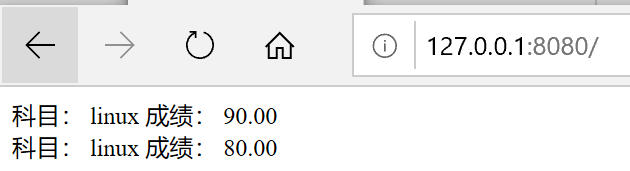

# sql_injection.py学习
## 实验要求
- [x] 学习 sql_injection.py
## 实验步骤
运行以后输入“1 or 1=1”,得到结果。数据为之前插入到数据库中的数据

## 代码学习
在这一句中将我们输入的数据和sql语句拼接在了一起进行了查询
```
sql = 'SELECT edu_admin_course.name, edu_admin_score.score FROM edu_admin_score INNER JOIN edu_admin_course ON edu_admin_score.course_id=edu_admin_course.id WHERE student_id = %s ' % input_data
```
紧接着调用库，执行sql语句
```
import sqlite3
            conn = sqlite3.connect('db.sqlite3')
            c = conn.cursor()
            query_result = c.execute(sql)
            response_content = ''
            for i in query_result:
                #response_content += '科目： %i 成绩： %.2f <br>' % i
                response_content += '科目： %s 成绩： %.2f <br>' % i
            conn.close()

            self.send_response(200)
            self.send_header("Content-type", "text/html;charset=utf-8")
            self.end_headers()
            self.wfile.write(( "<html><body>%s</body></html>" %response_content ).encode('UTF-8') )
```