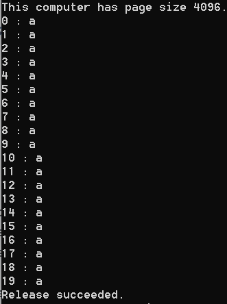
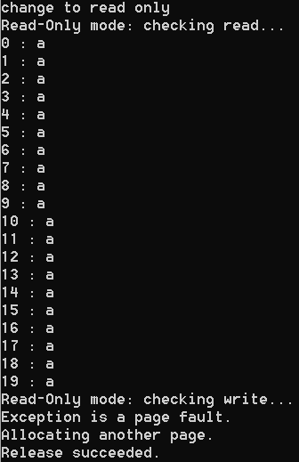
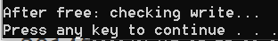

# 内存管理

## 实验要求
- [x] 阅读[VirtualAlloc](https://docs.microsoft.com/zh-cn/windows/win32/api/memoryapi/nf-memoryapi-virtualalloc)、[VirtualFree](https://docs.microsoft.com/en-us/windows/win32/api/memoryapi/nf-memoryapi-virtualfree)、[VirtualProtect](https://docs.microsoft.com/en-us/windows/win32/api/memoryapi/nf-memoryapi-virtualprotect)等函数的官方文档。
- [x] 编程使用malloc分配一段内存，测试是否这段内存所在的整个4KB都可以写入读取。
- [x] 使用VirtualAlloc分配一段，可读可写的内存，写入内存，然后将这段内存改为只读，再读数据和写数据，看是否会有异常情况。然后VirtualFree这段内存，再测试对这段内存的读写释放正常。

## 实验步骤
### 一、malloc分配一段内存
CHAR 类型数据占 1 个字节，4KB 为 4096 个字节
```
#include<iostream>
using namespace std;
int cnt = 0;
int main()
{
	char* a = (char*)malloc(100);
	for (int i = 0; i < 4096; i++)a[i] = '.';
	for (int i = 0; i < 4096; i++)
		if (a[i] == '.')cnt++;
	cout << "可存取字节数：" << cnt << endl;
	return 0;
}
```

### 二、VirtualAlloc分配内存
实验代码：  
>code/virtualtry.cpp
1. 使用VirtualAlloc分配一段可读可写的内存
* 参考[Memory Protection Constants](https://docs.microsoft.com/zh-cn/windows/win32/memory/memory-protection-constants)  
结果如下图所示：

2. 用VirtualProtect修改内存为只读
  
3. VirtualFree该段内存,再对这段内存进行读写，得到结果：异常退出,结果如下图所示
  
## 实验总结
经过此次实验明白：内存的有效性和访问属性，都是以4Kb为单位的，访问属性在分配内存时可以设置。
## 参考文献
[VirtualAlloc](https://docs.microsoft.com/zh-cn/windows/win32/api/memoryapi/nf-memoryapi-virtualalloc)  
[VirtualFree](https://docs.microsoft.com/en-us/windows/win32/api/memoryapi/nf-memoryapi-virtualfree)  
[VirtualProtect](https://docs.microsoft.com/en-us/windows/win32/api/memoryapi/nf-memoryapi-virtualprotect)  
[Memory Protection Constants](https://docs.microsoft.com/zh-cn/windows/win32/memory/memory-protection-constants)