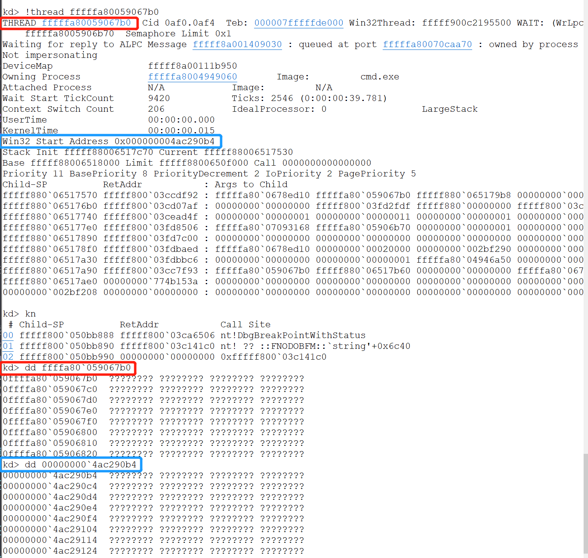
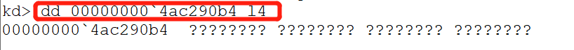

# 内存管理2
## 实验要求
1、验证不同进程的相同的地址可以保存不同的数据。
- [x] （1）在VS中，设置固定基地址，编写两个不同可执行文件。同时运行这两个文件。然后使用调试器附加到两个程序的进程，查看内存，看两个程序是否使用了相同的内存地址。
- [x] （2）在不同的进程中，尝试使用VirtualAlloc分配一块相同地址的内存，写入不同的数据。再读出。
2、（难度较高）配置一个Windbg双机内核调试环境，查阅Windbg的文档，了解以下内容：
- [x] （1）Windbg如何在内核调试情况下看物理内存，也就是通过物理地址访问内存。
- [x] （2）如何查看进程的虚拟内存分页表，在分页表中找到物理内存和虚拟内存的对应关系。然后通过Windbg的物理内存查看方式和虚拟内存的查看方式，看同一块物理内存中的数据情况。
## 实验步骤
### 1、验证不同进程的相同的地址可以保存不同的数据
#### 1.1 两个不同可执行文件，设置相同固定及地址，看两个程序是否使用了相同的内存地址
1. 如下图进行基地址设置

2. 如下图是本次实验的代码，让其大致相同。

3. 看到结果，两个程序确实使用了相同的内存地址

4. 总结：同时运行却能使用相同的地址，是因为使用的是虚拟地址，映射于不同的物理地址。
#### 1.2 使用VirtualAlloc分配一块相同地址的内存，写入不同的数据，再读出。
1. 代码及实验结果如下图所示，确实可以使用VirtualAlloc在相同的内存地址写入不同的数据，同样使用的是虚拟映射的原理。

### 2. 配置一个Windbg双机内核调试环境
#### 实验环境
物理机(Host):已安装windbg  
虚拟机(Guest):使用win7-64位系统
#### 2.0 实验准备：配置内核调试
1. Guest端：虚拟机串口设置如下图  

2. Guest端：启动虚拟机，进入Window内部进行配置。以管理员身份启动CMD,输入以下命令。
* DebugEntry的方式启动win7
```
    bcdedit /dbgsettings serial baudrate:115200 debugport:1
    bcdedit /copy {current} /d DebugEntry
    bcdedit /displayorder {current} {替换第二个命令显示的UUID}
    bcdedit /debug {替换第二个命令显示的UUID} on
```
运行结果如下图：  


3. Host:配置windbg符号下载地址  

4. Host进入windbg.exe所在文件夹，以下命令启动windbg  
```windbg.exe -k com:port=\\.\pipe\com_1,baud=115200,pipe```  
在显示'Waiting ro reconnect......'之后下断点，成功连接.而且此时win7系统已经无法动了.    
   
输入```!process 0 0```，显示出系统中的进程信息。

顺便从复习一下之前所学的线程和进程，以cmd.exe为例,查看进程和进程内部的线程信息。  
  
列出进程cmd.exe的详细信息，由于只有一个线程，查看该线程的信息。

#### 2.1 Windbg如何在内核调试情况下通过物理地址访问内存
1. 使用dd命令来查看虚拟内存中的内容，紧接着之前的操作，随意选两个地址来查看内容.由下图可以看到cmd.exe的虚拟地址'fffffa80`04949060',以及dirbase:114697000(这就是页帧数)
* 全是问号是因为确实没有内容

2. 还可以指定范围参数Ln，来示地址的前n个字节  

3. 但是以上实验只是虚拟地址，要通过物理地址访问，首先应该将虚拟地址转化为物理地址。
#### 2.2 查看进程的虚拟内存分页表，在分页表中找到物理内存和虚拟内存的对应关系然后通过Windbg的物理内存查看方式和虚拟内存的查看方式，看同一块物理内存中的数据情况。
1. 
## 实验问题
1. 在guest串口设置后启动时出现如下图报错  
  
解决：Pipe名写错了，改对即可。
2. Host打开windbg的时候一直reconnect

解决：一直以为是串口配置错误，还研究了很久想找到boot.ini，最后在waiting reconnect的时候下断点解决。
## 实验总结
1. 内核模式与用户模式区别：
内核模式没有用户模式的那么多限制，内核模式下运行的代码可以访问系统空间和当前用户模式进程的虚拟地址空间。使用哪种模式根据要调试的驱动类型进行选择：“如果您的目标是调试驱动程序，请确定该驱动程序是内核模式驱动程序还是用户模式驱动程序。Windows驱动程序模型(WDM)驱动程序和内核模式驱动程序框架(KMDF)都是内核模式驱动程序。顾名思义，用户模式驱动程序框架(UMDF)驱动程序是用户模式驱动程序。”因此，之前课程进行api钩取的时候，调试hookapi.exe我们使用的是用户模式，这一次进行内核模式的学习。  
2. 
## 参考文献
[VirtualAlloc function](https://docs.microsoft.com/en-us/windows/win32/api/memoryapi/nf-memoryapi-virtualalloc)   
[!db、!dc、!dd、!dp、!dq、!du、!dw](https://docs.microsoft.com/zh-cn/windows-hardware/drivers/debugger/-db---dc---dd---dp---dq---du---dw)  
[Getting Started with Windows Debugging](https://docs.microsoft.com/en-us/windows-hardware/drivers/debugger/getting-started-with-windows-debugging#4-determine-how-to-connect-the-target-and-host)  
[Getting Started with WinDbg (Kernel-Mode)](https://docs.microsoft.com/en-us/windows-hardware/drivers/debugger/getting-started-with-windbg--kernel-mode-)  
[Setting Up Kernel-Mode Debugging of a Virtual Machine Manually using a Virtual COM Port](https://docs.microsoft.com/en-us/windows-hardware/drivers/debugger/attaching-to-a-virtual-machine--kernel-mode-)  
[d、 da、 db、 dc、 dd、 dD、 df、 dp、 dq、 du，dw （显示内存）](https://docs.microsoft.com/zh-cn/windows-hardware/drivers/debugger/d--da--db--dc--dd--dd--df--dp--dq--du--dw--dw--dyb--dyd--display-memor)  
[debug-universal-drivers--kernel-mode-](https://docs.microsoft.com/en-us/windows-hardware/drivers/debugger/debug-universal-drivers--kernel-mode-)  
[pte](https://docs.microsoft.com/en-us/windows-hardware/drivers/debugger/-pte)  
[converting-virtual-addresses-to-physical-addresses](https://docs.microsoft.com/en-us/windows-hardware/drivers/debugger/converting-virtual-addresses-to-physical-addresses)
