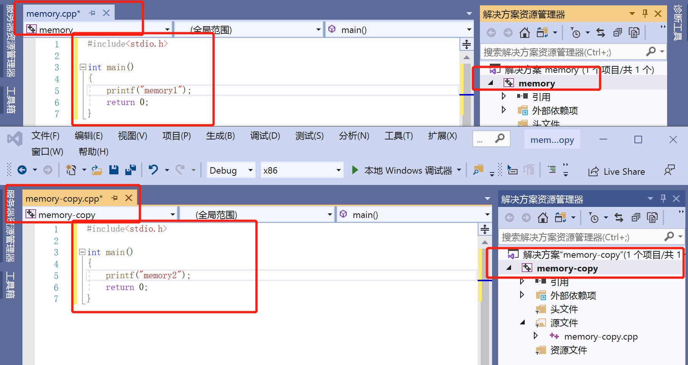
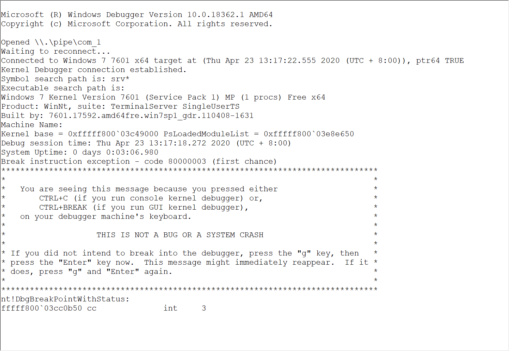

# 内存管理2
## 实验要求
1、验证不同进程的相同的地址可以保存不同的数据。
- [x] （1）在VS中，设置固定基地址，编写两个不同可执行文件。同时运行这两个文件。然后使用调试器附加到两个程序的进程，查看内存，看两个程序是否使用了相同的内存地址。
- [x] （2）在不同的进程中，尝试使用VirtualAlloc分配一块相同地址的内存，写入不同的数据。再读出。
2、（难度较高）配置一个Windbg双机内核调试环境，查阅Windbg的文档，了解以下内容：
- [x] （1）Windbg如何在内核调试情况下看物理内存，也就是通过物理地址访问内存。
- [x] （2）如何查看进程的虚拟内存分页表，在分页表中找到物理内存和虚拟内存的对应关系。然后通过Windbg的物理内存查看方式和虚拟内存的查看方式，看同一块物理内存中的数据情况。
## 实验步骤
### 1、验证不同进程的相同的地址可以保存不同的数据
#### 1.1 两个不同可执行文件，设置相同固定及地址，看两个程序是否使用了相同的内存地址
1. 如下图进行基地址设置

2. 如下图是本次实验的代码，让其大致相同。

3. 看到结果，两个程序确实使用了相同的内存地址

4. 总结：同时运行却能使用相同的地址，是因为使用的是虚拟地址，映射于不同的物理地址。
#### 1.2 使用VirtualAlloc分配一块相同地址的内存，写入不同的数据，再读出。
1. 代码及实验结果如下图所示，确实可以使用VirtualAlloc在相同的内存地址写入不同的数据，同样使用的是虚拟映射的原理。

### 2. 配置一个Windbg双机内核调试环境
#### 实验环境
物理机(Host):已安装windbg  
虚拟机(Guest):使用xp-sp3-32位系统
#### 2.0 实验准备：配置内核调试
1. virtualbox中设置：  

2. Guest:下载安装好xp-sp3,打开'我的电脑'，地址栏输入，找到boot.ini。  

2. Guest:boot.ini中添加内容并保存：```multi(0)disk(0)rdisk(0)partition(1)\WINDOWS="Microsoft Windows XP Professional" /noexecute=optin /fastdetect /debug /debugport=com1 /baudrate=115200```  
  
3. Guest:配置开启启动项

4. Guest:重启虚拟机，选择'DebugEntry'模式开启
5. Host:进入windbg.exe所在文件夹，以下命令启动windbg  
```windbg.exe -k com:port=\\.\pipe\com_1,baud=115200,pipe``` 
* 提前添加windbg符号下载地址 
6. 下断点，看到如下页面，说明配置成功。  

#### 2.1 Windbg如何在内核调试情况下通过物理地址访问内存
1. 首先应该将虚拟地址转化为物理地址，转换例子如下图：  
* 虚拟地址转换为物理地址有!vtop和!pte两种方式，但是!vtop有时候不好用，具体什么时候还没能总结出来。

* 后三位表示页内偏移，是由32位线性地址决定的。


2. 通过[!d*](https://docs.microsoft.com/zh-cn/windows-hardware/drivers/debugger/-db---dc---dd---dp---dq---du---dw)命令通过物理地址访问内存。具体区别如下图：  

* 2.1操作融合在2.2实验中
#### 2.2 查看进程的虚拟内存分页表，在分页表中找到物理内存和虚拟内存的对应关系然后通过Windbg的物理内存查看方式和虚拟内存的查看方式，看同一块物理内存中的数据情况。
得到的地址都是虚拟地址，需要通过物理地址访问内存，需要先将虚拟地址转化为物理地址，具体实验操作及结果如下图所示：  
  
结论：通过虚拟地址和对应的物理地址访问内存，得到的结果是一样的。
## 实验拓展
### windbg下看xp-sp3系统非分页内存
* x nt!MmNonPaged*列出了可能和非分页内存池相关的全局变量。
* nt!MmNonPagedPoolEnd0:保存基本NonPagedd内存池的结束地址
* nt!MmNonPagedSystemStart:保存基本NonPagedd内存池的开始地址
  
  
具体分析：[windbg下看系统非分页内存](https://blog.csdn.net/lixiangminghate/article/details/54667694)
### 计算查看PTE内容的两种方式
  
学到这里，去学习了[x86的控制寄存器CR0,CR1,CR2,CR3](https://blog.csdn.net/wyt4455/article/details/8691500)。收获：CR3是页目录基址寄存器，保存页目录表的物理地址，页目录表总是放在以4K字节为单位的存储器边界上，因此，它的地址的低12位总为0，不起作用，即使写上内容，也不会被理会。
## 实验问题
1. 在guest串口设置后启动时出现如下图报错  
  
解决：Pipe名写错了，改对即可。
2. Host打开windbg的时候一直reconnect

解决：一直以为是串口配置错误，还研究了很久想找到boot.ini，最后在waiting reconnect的时候下断点解决。
3. 一开始使用的是win7系统，得到四级页表，找到PTE对应的pfn发现pfn是17de3fx1000，超出了八位地址，因此重新安装系统换为了xp-sp3（32位）

* 对于四级页表，x64 虚拟地址共 64 位，高 16 位为符号扩展，要么全 0，要么全 1。Windows 中，全 1 表示内核地址，全 0 表示用户态地址。低 48 位划分：    

| 47-39(9 位) | 38-30(9 位) | 29-21(9 位) | 20-12(9 位) | 11-0(12 位) |  
| ----- | ----- | ----- | ----- | ----- |
|PML4E 索引(PXE)|PDPTE 索引(PPE)|PDE(页目录条目) 索引|PTE(页表条目) 索引|页内偏移|

4. win7虽然没有调试成功，但是这里附上内核调试的配置方式
* 1） Guest端：虚拟机串口设置如下图  

* 2) Guest端：启动虚拟机，进入Window内部进行配置。以管理员身份启动CMD,输入以下命令。
* DebugEntry的方式启动win7
```
    bcdedit /dbgsettings serial baudrate:115200 debugport:1
    bcdedit /copy {current} /d DebugEntry
    bcdedit /displayorder {current} {替换第二个命令显示的UUID}
    bcdedit /debug {替换第二个命令显示的UUID} on
```
运行结果如下图：  

* 3) Host:配置windbg符号下载地址 
* [Microsoft public symbol server](https://docs.microsoft.com/en-us/windows-hardware/drivers/debugger/microsoft-public-symbols)   

* 4) Host进入windbg.exe所在文件夹，以下命令启动windbg  
```windbg.exe -k com:port=\\.\pipe\com_1,baud=115200,pipe```  
在显示'Waiting ro reconnect......'之后下断点，成功连接.而且此时win7系统已经无法动了.    
   
输入```!process 0 0```，显示出系统中的进程信息。

顺便从复习一下之前所学的线程和进程，以cmd.exe为例,查看进程和进程内部的线程信息。  
  
列出进程cmd.exe的详细信息，由于只有一个线程，查看该线程的信息。


5. 之后再重新添加文件符号路径出现了'pdb not found'报错。    
解决：[参考](https://blog.csdn.net/xiangbaohui/article/details/103832850)    
首先开启科学上网（使用了蓝灯），接着进入到windbg.exe的目录下，如图命令行输入命令：    
  
接着在windbg中如下设置后reload  
  
查看相应的路径下看到符号文件下载成功。    
  
## 实验总结
1. 内核模式与用户模式区别：
内核模式没有用户模式的那么多限制，用户模式下运行的代码可以访问用户空间，但不能访问系统空间。 此限制可防止用户模式代码读取或更改受保护的操作系统数据结构。 内核模式下运行的代码既可以访问用户空间，也可以访问系统空间。内核模式下运行的代码可以访问系统空间和当前用户模式进程的虚拟地址空间。
2. 如何决定使用内核模式还是用户模式：根据要调试的驱动类型进行选择。———“如果您的目标是调试驱动程序，请确定该驱动程序是内核模式驱动程序还是用户模式驱动程序。Windows驱动程序模型(WDM)驱动程序和内核模式驱动程序框架(KMDF)都是内核模式驱动程序。顾名思义，用户模式驱动程序框架(UMDF)驱动程序是用户模式驱动程序。”因此，之前课程进行api钩取的时候，调试hookapi.exe我们使用的是用户模式，这一次进行内核模式的学习。  
3. [!d*](https://docs.microsoft.com/zh-cn/windows-hardware/drivers/debugger/-db---dc---dd---dp---dq---du---dw)命令通过物理地址访问内存。[d*](https://docs.microsoft.com/zh-cn/windows-hardware/drivers/debugger/)通过虚拟地址访问内存
4. 加深理解虚拟地址。虚拟地址访问内存有以下优势：
* 程序可以使用一系列连续的虚拟地址来访问物理内存中不连续的大内存缓冲区。
* 程序可以使用一系列虚拟地址来访问大于可用物理内存的内存缓冲区。 当物理内存的供应量变小时，内存管理器会将物理内存页（通常大小为 4 KB）保存到磁盘文件。 数据或代码页会根据需要在物理内存与磁盘之间移动。
* 不同进程使用的虚拟地址彼此隔离。 一个进程中的代码无法更改正在由另一进程或操作系统使用的物理内存。
## 参考文献
[VirtualAlloc function](https://docs.microsoft.com/en-us/windows/win32/api/memoryapi/nf-memoryapi-virtualalloc)   
[!db、!dc、!dd、!dp、!dq、!du、!dw](https://docs.microsoft.com/zh-cn/windows-hardware/drivers/debugger/-db---dc---dd---dp---dq---du---dw)  
[Getting Started with Windows Debugging](https://docs.microsoft.com/en-us/windows-hardware/drivers/debugger/getting-started-with-windows-debugging#4-determine-how-to-connect-the-target-and-host)  
[Getting Started with WinDbg (Kernel-Mode)](https://docs.microsoft.com/en-us/windows-hardware/drivers/debugger/getting-started-with-windbg--kernel-mode-)  
[Setting Up Kernel-Mode Debugging of a Virtual Machine Manually using a Virtual COM Port](https://docs.microsoft.com/en-us/windows-hardware/drivers/debugger/attaching-to-a-virtual-machine--kernel-mode-)  
[d、 da、 db、 dc、 dd、 dD、 df、 dp、 dq、 du，dw （显示内存）](https://docs.microsoft.com/zh-cn/windows-hardware/drivers/debugger/d--da--db--dc--dd--dd--df--dp--dq--du--dw--dw--dyb--dyd--display-memor)  
[debug-universal-drivers--kernel-mode-](https://docs.microsoft.com/en-us/windows-hardware/drivers/debugger/debug-universal-drivers--kernel-mode-)  
[!pte](https://docs.microsoft.com/en-us/windows-hardware/drivers/debugger/-pte)  
[converting-virtual-addresses-to-physical-addresses](https://docs.microsoft.com/en-us/windows-hardware/drivers/debugger/converting-virtual-addresses-to-physical-addresses)  
[Windows internal: Memory 2](https://ryan311.github.io/2014/03/22/windows-internal-memory-2/)  
[虚拟地址空间](https://docs.microsoft.com/zh-cn/windows-hardware/drivers/gettingstarted/virtual-address-spaces)  
[Windows 内核调试-win7](https://zhuanlan.zhihu.com/p/47771088)