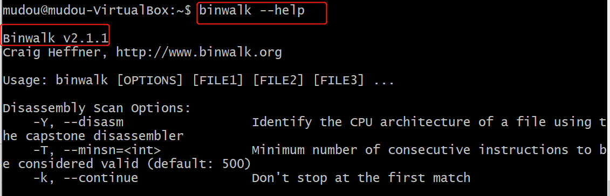
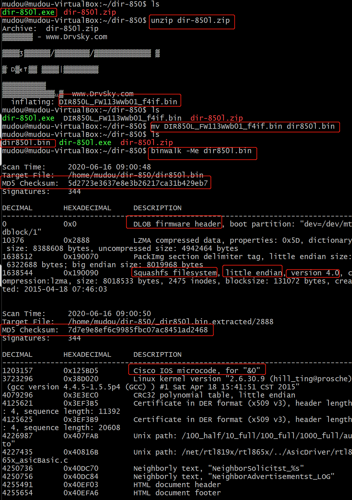
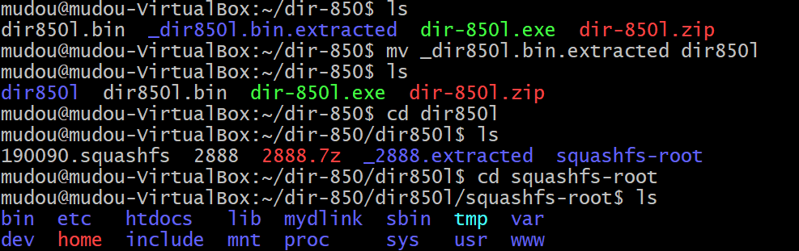
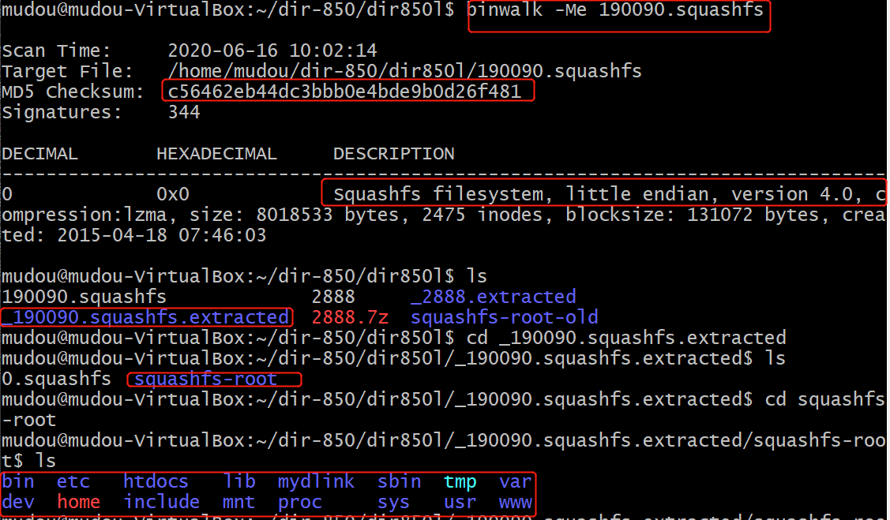
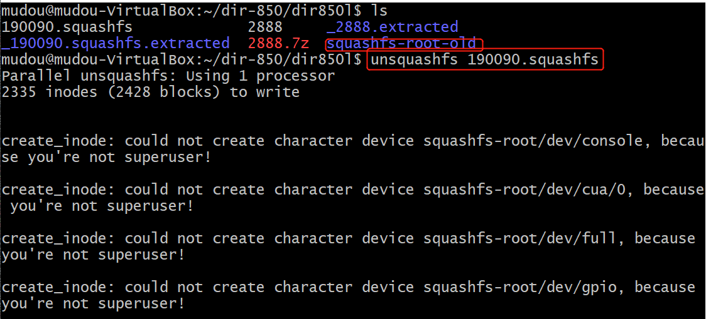
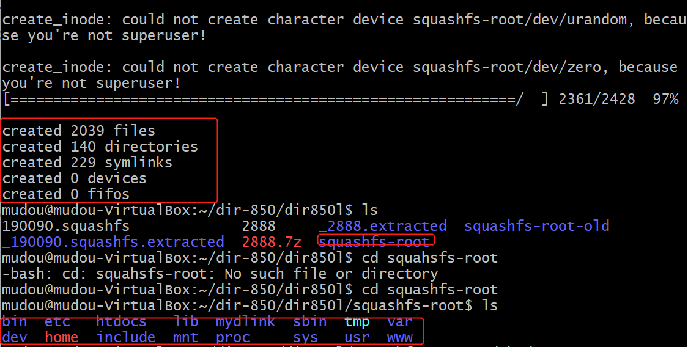
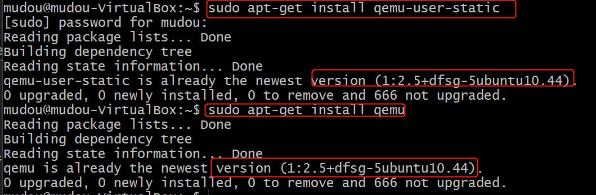
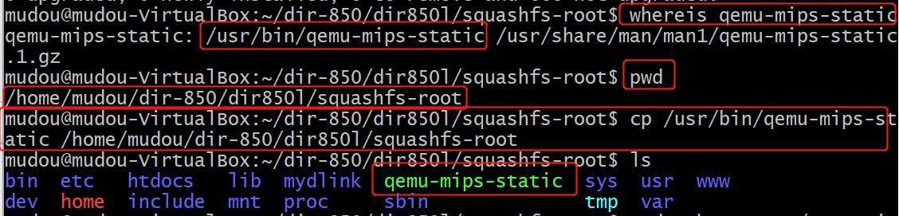

# Fuzzing

## 实验要求
- [x] 搜集市面上主要的路由器厂家,在厂家的官网中寻找可下载的固件在CVE漏洞数据中查找主要的家用路由器厂家的已经公开的漏洞，选择一两个能下载到切有已经公开漏洞的固件。
- [] 如果能下载对应版本的固件，在QEMU中模拟运行。确定攻击面（对哪个端口那个协议进行Fuzzing测试），尽可能多的抓取攻击面正常的数据包（wireshark）
- [] 查阅BooFuzz的文档，编写这对这个攻击面，这个协议的脚本，进行Fuzzing。配置BooFuzz QEMU的崩溃异常检测，争取触发一次固件崩溃，获得崩溃相关的输入测试样本和日志。尝试使用调试器和IDA-pro监视目标程序的崩溃过程，分析原理。
## 实验环境
## 实验步骤
### 一、固件下载并提取
1. 固件准备。  
使用scp将dir-850l.zip和dir-850l.exe拷贝到虚拟机中，，解压缩dir-850l.zip,得到DIR850L_FW113WWb01_f4if.bin文件，为了方便，更改文件名称为dir850l.bin。  
* [D-Link DIR-850L 固件下载](http://driver.zol.com.cn/detail/47/463483.shtml#download-box)或[D-Link DIR-850L 固件下载-驱动天空](https://www.drvsky.com/dlink/DIR-850L.htm#download)
2. 安装binwalk  
* [ubuntu 16.04 LTS-binwalk-manual](http://manpages.ubuntu.com/manpages/xenial/en/man1/binwalk.1.html)
```
sudo apt install binwalk
```
  
3. 固件提取  

```binwalk -Me dir850l.bin```提取固件，得到_dir850l.bin.extracted文件夹。

可以看到Squashfs系统，小端法。
* 这里md5校验码不一样是因为不是从官网下载，从别的网站上下载的zip文件，打包了别的东西。(在之后的分析中可以看到这里的想法是正确的。)  

重命名_dir850l.bin.extracted为dir850l。进入dir850l文件夹中看到190090.squashfs是我们的目标文件
* 此时这里已经有squashfs-root应该是别人已经分析过的文件.



接下来提取文件的方式有两种，无论哪种方法，得到的结果是一样的。  
一：使用 binwalk -Me 命令提取该文件。  
二：使用 unsquashfs 190090.squashfs 命令来提取文件。  
* [SquashFS HOWTO](https://www.tldp.org/HOWTO/html_single/SquashFS-HOWTO/)
* 重命名原有的squashfs-root为squashfs-root-old.  

binwalk提取的结果如下图：   
  
unsquashfs 190090.squashfs提取结果如下图：  

* 此处的'create_inode: could not create character device squashfs-root/dev/XXX, because you're not superuser!'是正常的，因此需要特别的权限create device files，并不会影响本次实验.[could not create character device "foo" because you're not superuser!](https://github.com/devttys0/sasquatch/issues/14)  


### 二、模拟运行固件
1. 安装qemu
* [qume](https://qume.io/)和[qemu](https://www.qemu.org/)傻傻分不清
* [Download QEMU](https://www.qemu.org/download/)
* user mode
```
sudo apt-get install qemu 
# 或sudo apt-get install qemu-user-static
```

2. 进入squashfs-root目录，将将qemu-mips-static拷贝到当前目录下
* 这里出现两个qemu-mips-static，选择前一个可执行文件


## 实验问题
## 实验总结
1. 路由器厂家学习
* [全球最好的八大消费类路由器品牌商](https://tnext.org/3773.html)
* [Netgear](https://en.wikipedia.org/wiki/Netgear)
* [Linksys](https://en.wikipedia.org/wiki/Linksys)
* [TP-Link](https://en.wikipedia.org/wiki/TP-Link)
* [D-Link](https://en.wikipedia.org/wiki/D-Link)
* [Cisco Systems](https://en.wikipedia.org/wiki/Cisco_Systems)
* 高端品牌：华硕、网件、领势等  
传统老牌：TP-LINK、水星、腾达等等    
新进品牌：小米（红米）、华为（荣耀）、360   
2. 路由器漏洞的威胁-有这么可怕吗？
参考：  
* [WiFi审判日：黑客劫持全球30万台无线路由器](https://www.aqniu.com/threat-alert/1998.html)  
* [路由器漏洞频发，有些永远不会修补？！](https://www.mottoin.com/detail/2596.html)
* [The 5 most common router attacks on a network](https://www.intelligentcio.com/eu/2017/10/16/the-5-most-common-router-attacks-on-a-network/)
* [Router attacks: Five simple tips to lock criminals out](https://www.welivesecurity.com/2014/05/23/router-attacks-five-simple-tips-lock-criminals/)
* [中国十大路由器厂家排行榜](https://www.douban.com/note/548077904/)  
威胁总结：  
* 信息窃取：除了直接获取账号和密码，也可能跳转到钓鱼网站
* 通过路由器控制智能家居，危险无处不在
* 促进黑产
* 厂商的不安全亦是用户的不安全
* 路由器被当作犯罪跳板

常见的攻击手段总结：  
* Denial of Service (DOS)
* Packet Mistreating Attacks (PMA)
* Routing Table Poisoning (RTP)
* Hit and Run (HAR)
* Persistent Attacks (PA)
3. qume运行两种模式：   
* 本次实验选择user mode  

user mode : qemu-mips(mipsel/arm)-static。用户只需要将各种不同平台的处理编译得到的Linux程序放在QEMU虚拟中运行即可，其他的事情全部由QEMU虚拟机来完成，不需要用户自定义内核和虚拟磁盘等文件。    
system mode:qemu-system-mips(mipsel) : 用户可以为QEMU虚拟机指定运行的内核或者虚拟硬盘等文件，简单来说系统模式下QEMU虚拟机是可根据用户的要求配置的。  

4. 熵：一个系统越是有序，信息熵就越低；反之，一个系统越是混乱，信息熵就越高。  
* [Differentiate Encryption From Compression Using Math](http://www.devttys0.com/2013/06/differentiate-encryption-from-compression-using-math/):The entropy of data can tell us a lot about the data’s contents. Encrypted data is typically a flat line with no variation, while compressed data will often have at least some variation.  
* [Encryption vs Compression, Part 2](http://www.devttys0.com/2013/06/encryption-vs-compression-part-2/)    
## 参考文献
[boofuzz: Network Protocol Fuzzing for Humans](https://boofuzz.readthedocs.io/en/stable/)  
[QEMU](https://www.qemu.org/)  
[QEMU version 4.2.0 User Documentati](https://qemu.weilnetz.de/doc/qemu-doc.html)  
[路由器漏洞分析系列（1）：路由器固件模拟环境搭建](https://xz.aliyun.com/t/5697)  
[路由器漏洞挖掘之栈溢出入门（二）](https://juejin.im/entry/5c79430df265da2db5424f94)  
[D-Link系列路由器漏洞挖掘入门](https://paper.seebug.org/429/)  
[利用DVRF学习固件分析系列（一）](https://www.anquanke.com/post/id/84580)  
[D-Link DIR-850L路由器分析之获取设备shell](https://cq674350529.github.io/2019/03/18/D-Link-DIR-850L%E8%B7%AF%E7%94%B1%E5%99%A8%E5%88%86%E6%9E%90%E4%B9%8B%E8%8E%B7%E5%8F%96%E8%AE%BE%E5%A4%87shell/)  
[D-Link 850L&645路由漏洞分析](https://xz.aliyun.com/t/2941)    
[dir815_FW_102.bin路由器固件解压碰到的坑](https://www.jianshu.com/p/29c99274ff85)  
[DLink路由器固件的一次分析记录](https://bbs.pediy.com/thread-209773.htm)