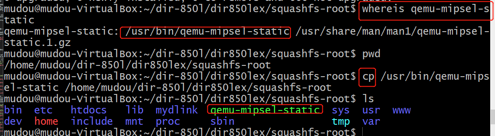

# Fuzzing

## 实验要求
- [x] 搜集市面上主要的路由器厂家,在厂家的官网中寻找可下载的固件在CVE漏洞数据中查找主要的家用路由器厂家的已经公开的漏洞，选择一两个能下载到切有已经公开漏洞的固件。
- [] 如果能下载对应版本的固件，在QEMU中模拟运行。确定攻击面（对哪个端口那个协议进行Fuzzing测试），尽可能多的抓取攻击面正常的数据包（wireshark）
- [] 查阅BooFuzz的文档，编写这对这个攻击面，这个协议的脚本，进行Fuzzing。配置BooFuzz QEMU的崩溃异常检测，争取触发一次固件崩溃，获得崩溃相关的输入测试样本和日志。
- [] 尝试使用调试器和IDA-pro监视目标程序的崩溃过程，分析原理。
## 实验环境
ubuntu-16.04-desktop
## 实验步骤
### 一、固件下载并提取
1. 固件准备。  
固件下载地址：[DIR 850l-Download direct](http://files.dlink.com.au/products/DIR-850L)
```
# 物理机上操作：
scp DIR850LA1_FW114WWb07.bin mudou@192.168.57.117:/home/mudou/dir-850l/
# 虚拟机中操作：
mkdir dir850l
mv DIR850LA1_FW114WWb07.bin dir850l.bin
```
2. 安装binwalk  
* [ubuntu 16.04 LTS-binwalk-manual](http://manpages.ubuntu.com/manpages/xenial/en/man1/binwalk.1.html)
```
sudo apt install binwalk
```
    
3. 提取固件  
* M ，—matryoshka 递归扫描可解压的
* e，—extract 提取
* 解压到的是_XXXXXX.bin.extracted/
```
binwalk -Me dir850l.bin
unsquashfs 190090.squashfs
```
### 二、模拟运行固件（两种方式）
 
### 2-1.安装qemu
* [qume](https://qume.io/)和[qemu](https://www.qemu.org/)傻傻分不清
* [Download QEMU](https://www.qemu.org/download/)
```
sudo apt-get install qemu qemu-user-static 
sudo apt-get -y install qemu qemu-system qemu-user-static qemu-user

# install build-essential
sudo apt-get -y install build-essential

# 查看当前版本 
qemu-img --version
```      

使用file查看固件架构

根据ELF文件格式，使用相应的qemu程式模拟。
```
# 由于使用的是mips,查找qemu-mips-static,将qemu-mips-static拷贝到squashfs-root文件夹下
whereis  qemu-mips-static 
cp  qemu-mips-static squashfs-root/ 
```

```
cp /usr/bin/qemu-mips-static ./
sudo chroot . ./qemu-mips-static ./bin/ls
ls
```
出现了目录，说明qemu可以正常使用了。    
 
### 2-2.1：模拟运行方式一 ---（user mode）FAT模拟运行固件
* [QEMU User space emulator](https://www.qemu.org/docs/master/user/main.html)
* [QemuUserEmulation](https://wiki.debian.org/QemuUserEmulation)
* [路由器固件模拟环境搭建（超详细）](https://zhuanlan.zhihu.com/p/146228197)

```
sudo apt-get install bridge-utils uml-utilities
```
* FAT-[Firmware Analysis Toolkit](https://github.com/attify/firmware-analysis-toolkit):FIRMADYNE is an automated and scalable system for performing emulation and dynamic analysis of Linux-based embedded firmware.
```
# To install just clone the repository and run the script ./setup.sh.
git clone https://github.com/attify/firmware-analysis-toolkit
cd firmware-analysis-toolkit
./setup.sh

sudo vim fat.config
# edit as follows:
[DEFAULT]
sudo_password=attify123 # sudo password
firmadyne_path=/home/attify/firmadyne # address of firmadyne

# 将固件.bin文件拷贝到firmware-analysis-toolkit文件夹下
./fat.py dir850.bin
```
 
[默认用户名Admin,默认密码为空.](http://support.routercheck.com/D-Link/DIR-850L/DefaultPassword-3.html)

### 2-2.2：模拟运行方式二 --- （system mode）qemu安装mips虚拟机
* [QEMU System Emulator Targets](https://www.qemu.org/docs/master/system/targets.html)
* [MIPS System emulator](https://www.qemu.org/docs/master/system/target-mips.html)
* [How to build a Debian MIPS image on QEMU](https://markuta.com/how-to-build-a-mips-qemu-image-on-debian/) 
* [MIPS环境填坑指南](https://zhuanlan.zhihu.com/p/110365843) 
* [Emulating Embedded Linux Devices with QEMU](https://www.novetta.com/2018/02/emulating-embedded-linux-devices-with-qemu/)
* [QEMU System Emulation User’s Guide](https://www.qemu.org/docs/master/system/index.html)

* [Fuzzing Embedded Linux Devices](https://www.novetta.com/2018/07/fuzzing-embedded-linux-devices/)  
* [Emulating Embedded Linux Devices with QEMU](https://www.novetta.com/2018/02/emulating-embedded-linux-devices-with-qemu/)  
* [Emulating Embedded Linux Systems with QEMU](https://www.novetta.com/2018/02/emulating-embedded-linux-systems-with-qemu/)
* [Dynamic Analysis of Firmware Using Firmadyne](https://opensourceforu.com/2018/09/dynamic-analysis-of-firmware-using-firmadyne/)  
* [D-Link: A Firmware Security Analysis – Part 2](https://www.refirmlabs.com/d-link-a-firmware-security-analysis-part-2/)
* [D-Link: A Firmware Security Analysis – Part 3](https://www.refirmlabs.com/d-link-a-firmware-security-analysis-part-3/)
* [D-Link: A Firmware Security Analysis – Part 4](https://www.refirmlabs.com/d-link-a-firmware-security-analysis-part-4/)
* [Getting started with Firmware Emulation for IoT Devices](https://blog.attify.com/getting-started-with-firmware-emulation/) 
* [DLink RCE 漏洞 CVE-2019-17621 分析](https://www.geekmeta.com/article/1292672.html) 
* [IoT安全：调试环境搭建教程(MIPS篇)](https://bbs.pediy.com/thread-229583.htm)
* [在QEMU MIPS虚拟机上运行MIPS程序（ssh方式](http://zeroisone.cc/2018/03/20/%E5%9B%BA%E4%BB%B6%E6%A8%A1%E6%8B%9F%E8%B0%83%E8%AF%95%E7%8E%AF%E5%A2%83%E6%90%AD%E5%BB%BA/#qemu%E6%A8%A1%E6%8B%9Fmips%E7%A8%8B%E5%BA%8F)
* [DLink RCE漏洞CVE-2019-17621分析](https://www.freebuf.com/vuls/228726.html)
* [使用QEMU配置一台虚拟MIPS系统](https://blog.sbw.so/u/create-mips-virtual-machine-in-qemu.html)
* [路由器逆向分析------在QEMU MIPS虚拟机上运行MIPS程序（ssh方式）](https://blog.csdn.net/QQ1084283172/article/details/69652258)

1. 查看qemu版本信息```qemu-img --version```  

2. 使用debian开发人员做好的镜像，其中已经包含了debian的squeeze版,下载[debian_squeeze_mips_standard.qcow2和vmlinux-2.6.32-5-4kc-malta](https://people.debian.org/~aurel32/qemu/mips/),使用scp拷贝到虚拟机中。  

3. 配置
```
# 安装依赖
sudo apt-get install bridge-utils uml-utilities

# 修改ubuntu主机网络配置
sudo vim /etc/network/interfaces
# change as follows:
auto lo
iface lo inet loopback
 
# ubuntu 16.04的系统用ens33代替eth0
auto ens33
iface ens33 inet manual
up ifconfig ens33 0.0.0.0 up
 
auto br0
iface br0 inet dhcp
bridge_ports ens33
bridge_stp off
bridge_maxwait 1


# 修改QEMU的网络接口启动脚本，重启网络使配置生效
sudo vim /etc/qemu-ifup
# as follows:
#!/bin/sh
echo "Executing /etc/qemu-ifup"
echo "Bringing $1 for bridged mode..."
sudo /sbin/ifconfig $1 0.0.0.0 promisc up
echo "Adding $1 to br0..."
sudo /sbin/brctl addif br0 $1
sleep 3
```

### fuzzing
[boofuzz: Network Protocol Fuzzing for Humans](https://boofuzz.readthedocs.io/en/stable/) 
```
Step1-安装python3
# install
sudo add-apt-repository ppa:jonathonf/python-3.6
sudo apt-get update
sudo apt-get install python3.6
# 设置为默认
sudo update-alternatives --install /usr/bin/python3 python3 /usr/bin/python3.5 1
sudo update-alternatives --install /usr/bin/python3 python3 /usr/bin/python3.6 2
sudo update-alternatives --config python3
# 确认版本
python3 -V
```


## 实验问题
### 1. 固件提取第一次尝试结果（没有错，但是下载的不是官方的文件，总有些别扭，因此重新再来）  

固件下载地址：  
* [D-Link DIR-850L 固件下载](http://driver.zol.com.cn/detail/47/463483.shtml#download-box)
* [D-Link DIR-850L 固件下载-驱动天空](https://www.drvsky.com/dlink/DIR-850L.htm#download)

使用scp将dir-850l.zip和dir-850l.exe拷贝到虚拟机中，解压缩dir-850l.zip,得到DIR850L_FW113WWb01_f4if.bin，更改文件名称为dir850l.bin。 
```binwalk -Me dir850l.bin```提取固件，得到_dir850l.bin.extracted文件夹。  
  
可以看到Squashfs系统，小端法。压缩包的md5校验码和压缩包内部2888文件的校验码。   
重命名_dir850l.bin.extracted为dir850l。进入dir850l文件夹中看到190090.squashfs是我们的目标文件。
   
提取文件，方式两种，无论哪种方法，得到的结果是一样的。  
一：使用 binwalk -Me 命令提取该文件。  
二：使用 unsquashfs 190090.squashfs 命令来提取文件。  
* [SquashFS HOWTO](https://www.tldp.org/HOWTO/html_single/SquashFS-HOWTO/)
* 重命名原有的squashfs-root为squashfs-root-old.  

binwalk提取的结果如下图：   
  
unsquashfs 190090.squashfs提取结果如下图：  

* 此处的'create_inode: could not create character device squashfs-root/dev/XXX, because you're not superuser!'是正常的，因此需要特别的权限create device files，并不会影响本次实验.[could not create character device "foo" because you're not superuser!](https://github.com/devttys0/sasquatch/issues/14)  


### 2. 第一次拷贝qemu tool时弄错了二进制结构  
进入squashfs-root目录，将将qemu-mipsel-static拷贝到当前目录下  
   
总结：应该先查看类型再拷贝

### 3. ```sudo chroot . ./qemu-mips-static ./bin/sh```开启模拟运行以后，报错'command not found'.  

解决：  
```
$ exit
$ sudo modprobe binfmt_misc
$ sudo mount binfmt_misc -t binfmt_misc /proc/sys/fs/binfmt_misc
$ sudo -s
# echo ':mips:M::\x7fELF\x01\x02\x01\x00\x00\x00\x00\x00\x00\x00\x00\x00\x00\x02\x00\x08:\xff\xff\xff\xff\xff\xff\xff\x00\xff\xff\xff\xff\xff\xff\xff\xff\xff\xfe\xff\xff:/qemu:' > /proc/sys/fs/binfmt_misc/register
# exit
$ cp ./qemu-mips-static ./qemu
```

### 4. 虚拟机扩容 - 仅仅磁盘扩容是不够的，系统依然无法使用
解决：[VirtualBox文件系统已满--磁盘扩容](https://www.cnblogs.com/cthon/p/9334828.html)

### 5. ```sudo chroot . ./qemu-mips-static ./bin/ls```后输入```ls```会出现ls:not found的错误.
解决：  
```
$ exit
$ sudo modprobe binfmt_misc
$ sudo mount binfmt_misc -t binfmt_misc /proc/sys/fs/binfmt_misc
$ sudo -s
# echo ':mips:M::\x7fELF\x01\x02\x01\x00\x00\x00\x00\x00\x00\x00\x00\x00\x00\x02\x00\x08:\xff\xff\xff\xff\xff\xff\xff\x00\xff\xff\xff\xff\xff\xff\xff\xff\xff\xfe\xff\xff:/qemu:' > /proc/sys/fs/binfmt_misc/register
# exit
$ cp ./qemu-mips-static ./qemu
```
再次运行```sudo chroot . ./qemu-mips-static ./bin/sh```成功，说明qemu可以正常使用了。    
 

### 6. ```sudo apt-get install curses-devel```报错：'Unable to locate package curses-devel'  
解决：参考[ubuntu16.04安装ncurses-devel](https://blog.csdn.net/WANG__RONGWEI/article/details/54846759)，使用```sudo apt-get install libncurses5-dev```

### 7. 执行```sudo apt-get```的时候出现报错'Unable to lock the administration directory (/var/lib/dpkg/), is another process using it?'   

## 实验总结
### 1. 路由器厂家学习总结
* 参考[全球最好的八大消费类路由器品牌商](https://tnext.org/3773.html)
* [Netgear](https://en.wikipedia.org/wiki/Netgear)
* [Linksys](https://en.wikipedia.org/wiki/Linksys)
* [TP-Link](https://en.wikipedia.org/wiki/TP-Link)
* [D-Link](https://en.wikipedia.org/wiki/D-Link)
* [Cisco Systems](https://en.wikipedia.org/wiki/Cisco_Systems)
* 总结：  
高端品牌：华硕、网件、领势等  
传统老牌：TP-LINK、水星、腾达等等    
新进品牌：小米（红米）、华为（荣耀）、360   

### 2. 路由器漏洞的威胁-有这么可怕吗？   
* 参考：
  - [WiFi审判日：黑客劫持全球30万台无线路由器](https://www.aqniu.com/threat-alert/1998.html)  
  - [路由器漏洞频发，有些永远不会修补？！](https://www.mottoin.com/detail/2596.html)
  - [The 5 most common router attacks on a network](https://www.intelligentcio.com/eu/2017/10/16/the-5-most-common-router-attacks-on-a-network/)
  - [Router attacks: Five simple tips to lock criminals out](https://www.welivesecurity.com/2014/05/23/router-attacks-five-simple-tips-lock-criminals/)
  - [中国十大路由器厂家排行榜](https://www.douban.com/note/548077904/)  

威胁总结：  
* 信息窃取：除了直接获取账号和密码，也可能跳转到钓鱼网站
* 通过路由器控制智能家居，危险无处不在
* 促进黑产
* 厂商的不安全亦是用户的不安全
* 路由器被当作犯罪跳板

常见的攻击手段总结：  
* Denial of Service (DOS)
* Packet Mistreating Attacks (PMA)
* Routing Table Poisoning (RTP)
* Hit and Run (HAR)
* Persistent Attacks (PA)

### 3. qume运行两种模式：  
* [Qemu: User mode emulation and Full system emulation](https://www.cnblogs.com/pengdonglin137/p/5020143.html)  
* [QEMU-wiki](https://zh.wikipedia.org/wiki/QEMU)   

user mode : qemu-mips(mipsel/arm)-static。User mode：又称作“用户模式”，在这种模块下，QEMU运行针对不同指令编译的单个Linux或Darwin/macOS程序。系统调用与32/64位接口适应。在这种模式下，我们可以实现交叉编译（cross-compilation）与交叉侦错（cross- debugging）。  

system mode:qemu-system-mips(mipsel) : “系统模式”，在这种模式下，QEMU模拟一个完整的计算机系统，包括外围设备。它可以用于在一台计算机上提供多台虚拟计算机的虚拟主机。 QEMU可以实现许多客户机OS的引导，比如x86，MIPS，32-bit ARMv7，PowerPC等等。   

因此，在qemu运行固件的方式也有两种：  
① 将文件系统上传到 qemu mips 虚拟机中运行（system mode）    
② 借助 firmadyne 工具运行固件(user mode)

### 4. 熵：一个系统越是有序，信息熵就越低；反之，一个系统越是混乱，信息熵就越高。  
* 参考：  
   - [Differentiate Encryption From Compression Using Math](http://www.devttys0.com/2013/06/differentiate-encryption-from-compression-using-math/):The entropy of data can tell us a lot about the data’s contents. Encrypted data is typically a flat line with no variation, while compressed data will often have at least some variation.  
  - [Encryption vs Compression, Part 2](http://www.devttys0.com/2013/06/encryption-vs-compression-part-2/)  

### 5. 本次实验dir-850l固件下载地址集锦：
* [D-Link DIR-850L 固件下载](http://driver.zol.com.cn/detail/47/463483.shtml#download-box)
* [D-Link DIR-850L 固件下载-驱动天空](https://www.drvsky.com/dlink/DIR-850L.htm#download)
* [D-LINK官网](https://support.dlink.com/ProductInfo.aspx?m=dir-850L)
* [DIR-850L-D-Link Australia & New Zealand Support Resources](http://support.dlink.com.au/Download/download.aspx?product=DIR-850L)  

### 6. 查看固件架构两种方式。  
查看方法一：使用[rabin](http://www.linuxcertif.com/man/1/rabin/) - Binary program info extractor
```
# install radare
git clone https://github.com/radare/radare2.git
cd radare2/sys
./install.sh 
cd ..

ls -lF ./bin/ls
# output:
# lrwxrwxrwx 1 mudou mudou 7 6月  16 14:11 ./bin/ls -> busybox*
rabin2 -I ./bin/busybox
# output: arch mips
rabin2 -l ./bin/busybox
```
    
查看方法二：使用file
使用file得到更多详细信息  


### 7. mips vs mipsel vs mips64el  
[MIPSPort](https://wiki.debian.org/MIPSPort):Through the Debian 10 ("buster") release, Debian currently provides 3 ports, 'mips', 'mipsel', and 'mips64el'. The 'mips' and 'mipsel' ports are respectively big and little endian variants, using the O32 ABI with hardware floating point. They use the MIPS II ISA in Jessie and the MIPS32R2 ISA in Stretch and later. The 'mips64el' port is a 64-bit little endian port using the N64 ABI, hardware floating point and the MIPS64R2 ISA.   
总结：   
mips 是32位大端字节序   
mipsel 是32位小端字节序   
mips64el 是64位小端字节序 

### 本次实验心得
1. 做实验的过程中，没有思路，或者忘了方法，回头看看老师曾经说了什么。
## 参考文献
[boofuzz: Network Protocol Fuzzing for Humans](https://boofuzz.readthedocs.io/en/stable/)  
[QEMU](https://www.qemu.org/)  
[QEMU version 4.2.0 User Documentati](https://qemu.weilnetz.de/doc/qemu-doc.html)  
[QEMU System Emulator Targets](https://www.qemu.org/docs/master/system/targets.html)

[路由器漏洞分析系列（1）：路由器固件模拟环境搭建](https://xz.aliyun.com/t/5697)  
[D-Link 850L&645路由漏洞分析](https://xz.aliyun.com/t/2941)    

漏洞分析：  
[路由器漏洞复现分析第二弹：CNVD-2018-01084 ](https://www.freebuf.com/vuls/162627.html)  
[D-Link系列路由器漏洞挖掘入门](https://paper.seebug.org/429/)  
[D-Link DIR-850L 路由器漏洞验证报告](https://gorgias.me/2017/08/11/D-Link-DIR-850L-%E8%B7%AF%E7%94%B1%E5%99%A8%E6%BC%8F%E6%B4%9E%E9%AA%8C%E8%AF%81%E6%8A%A5%E5%91%8A/) 
