# KLEE

## 实验要求
- [x]安装KLEE
- []完成官方tutorials
## 实验环境
ubuntu 18.04 server
## 实验步骤
* klee的安装有多种方式：  
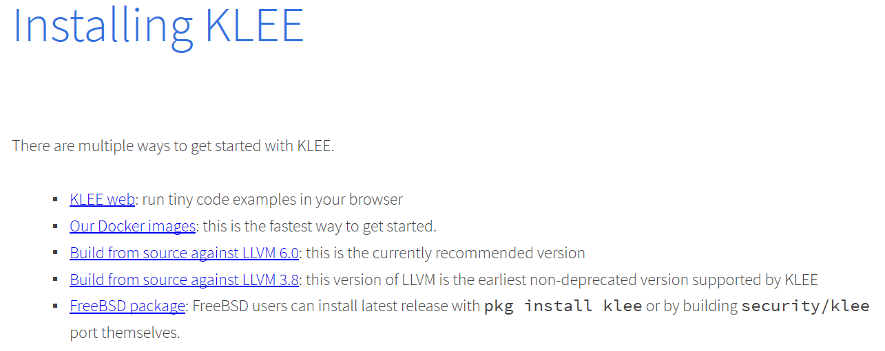  
本次试验选用docker的方式。

1.安装Docker Engine - Enterprise
```
1.设置仓库
# 更新 apt 包索引。
$ sudo apt-get update
# 安装 apt 依赖包，用于通过HTTPS来获取仓库:
$ sudo apt-get install \
    apt-transport-https \
    ca-certificates \
    curl \
    gnupg-agent \
    software-properties-common
# 添加 Docker 的官方 GPG 密钥：
$ curl -fsSL https://download.docker.com/linux/ubuntu/gpg | sudo apt-key add -
# 得到9DC8 5822 9FC7 DD38 854A  E2D8 8D81 803C 0EBF CD88 通过搜索指纹的后8个字符，验证您现在是否拥有带有指纹的密钥。
$ sudo apt-key fingerprint 0EBFCD88    
pub   rsa4096 2017-02-22 [SCEA]
      9DC8 5822 9FC7 DD38 854A  E2D8 8D81 803C 0EBF CD88
uid           [ unknown] Docker Release (CE deb) <docker@docker.com>
sub   rsa4096 2017-02-22 [S]
# 使用以下指令设置稳定版仓库
$ sudo add-apt-repository \
   "deb [arch=amd64] https://download.docker.com/linux/ubuntu \
  $(lsb_release -cs) \
  stable"

2. 安装 Docker Engine-Community
# 更新 apt 包索引。
$ sudo apt-get update
# 安装最新版本的 Docker Engine-Community 和 containerd ，或者转到下一步安装特定版本：
$ sudo apt-get install docker-ce docker-ce-cli containerd.io
# 列出您的仓库中可用的版本：
$ apt-cache madison docker-ce
# 这里直接安装，没有指定序列号
$ sudo apt-get install docker-ce 
测试 Docker 是否安装成功
$ sudo docker run hello-world
```
当前docker版本信息如下图：  
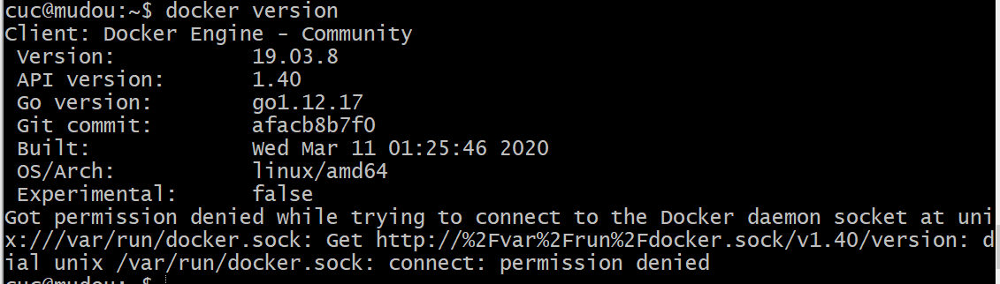  
2. 安装klee和基本使用
```
# Pulling from the Docker Hub
$ docker pull klee/klee:2.0

# Building the Docker image locally
$ git clone https://github.com/klee/klee.git
$ cd klee
$ docker build -t klee/klee 

# Creating a KLEE Docker container
# --ulimit option sets an unlimited stack size inside the container. This is to avoid stack overflow issues when running KLEE.
docker run --rm -ti --ulimit='stack=-1:-1' klee/klee
```
klee版本信息如下图：  
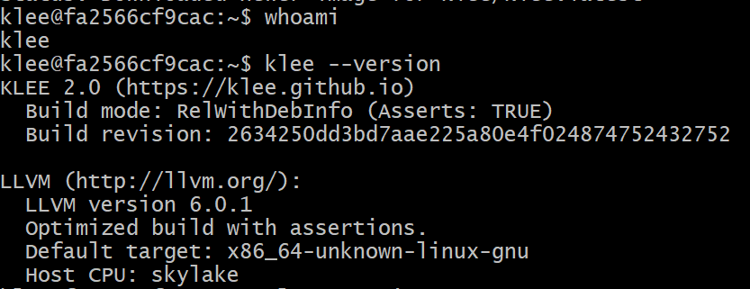 
clang版本信息如下图：  
 
```
# Persistent Containers
docker run -ti --name=my_first_klee_container --ulimit='stack=-1:-1' klee/klee
```
```
klee@1fd39056dfa5:~$ pwd
/home/klee
klee@1fd39056dfa5:~$ echo "int main(int argn, char** argv) { return 0; }" > test.c
klee@1fd39056dfa5:~$ clang -emit-llvm -g -c test.c -o test.bc
klee@1fd39056dfa5:~$ klee --libc=uclibc --posix-runtime test.bc
KLEE: NOTE: Using POSIX model: /tmp/klee_build60stp_z3/Debug+Asserts/lib/libkleeRuntimePOSIX.bca
KLEE: NOTE: Using klee-uclibc : /tmp/klee_build60stp_z3/Debug+Asserts/lib/klee-uclibc.bca
KLEE: output directory is "/home/klee/klee-out-0"
KLEE: Using STP solver backend
warning: Linking two modules of different target triples: test.bc' is 'x86_64-unknown-linux-gnu' whereas '__uClibc_main.os' is 'x86_64-pc-linux-gnu'
KLEE: WARNING ONCE: calling external: syscall(16, 0, 21505, 47460912) at /tmp/klee_src/runtime/POSIX/fd.c:980 10
KLEE: WARNING ONCE: calling __user_main with extra arguments.
KLEE: WARNING ONCE: Alignment of memory from call "malloc" is not modelled. Using alignment of 8.
KLEE: done: total instructions = 13174
KLEE: done: completed paths = 1
KLEE: done: generated tests = 1
klee@1fd39056dfa5:~$ ls
klee-last  klee-out-0  klee_build  klee_src  test.bc  test.c
klee@1fd39056dfa5:~$ exit
```
使用命名的方式很明显看到确实多了一个docker image  
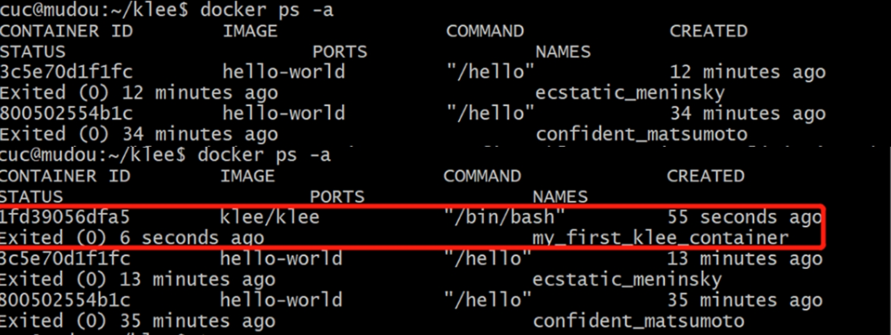  
```
# restart the container
docker start -ai my_first_klee_container
# remove
docker rm my_first_klee_container
```
删除docker image前后对比   
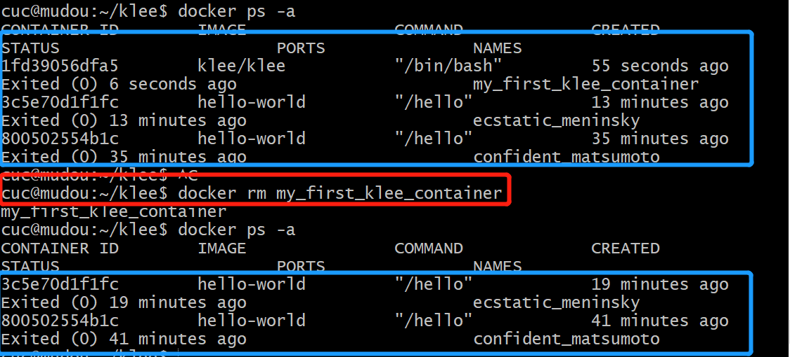  
3. First tutorial: Testing a small function.  
```
# 启动klee
docker run -ti --name=my_first_klee_container --ulimit='stack=-1:-1' klee/klee
# 进入get_sign.c所在目录
cd klee_src/examples/get_sign/
# Compiling to LLVM bitcode
clang -I ../../include -emit-llvm -c -g -O0 -Xclang -disable-O0-optnone get_sign.c
# Running KLEE
klee get_sign.bc
# ls klee-last/
```
* -I参数，以便编译器可以找到klee/klee.h其中包含用于与KLEE虚拟机交互的内在函数的定义。
* -c是因为我们只想将代码编译成一个目标文件(而不是一个本机可执行文件)。
* -g导致将其他调试信息存储在目标文件中，KLEE将使用这些信息来确定源代码行号信息。
* -O0 -Xclang -disable-O0-optnone编译时不进行任何优化，但不阻止KLEE执行自己的优化，而使用-O0编译则会。

运行结果如下图：  
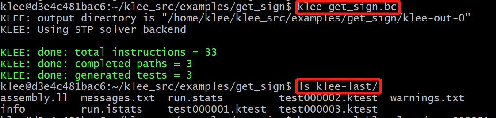
查看测试结果,每一个测试文件包括调用的参数、符号对象、路径的数量(只有一个)、象征性的对象的名字(a)、它的大小(4)
* int占4字节

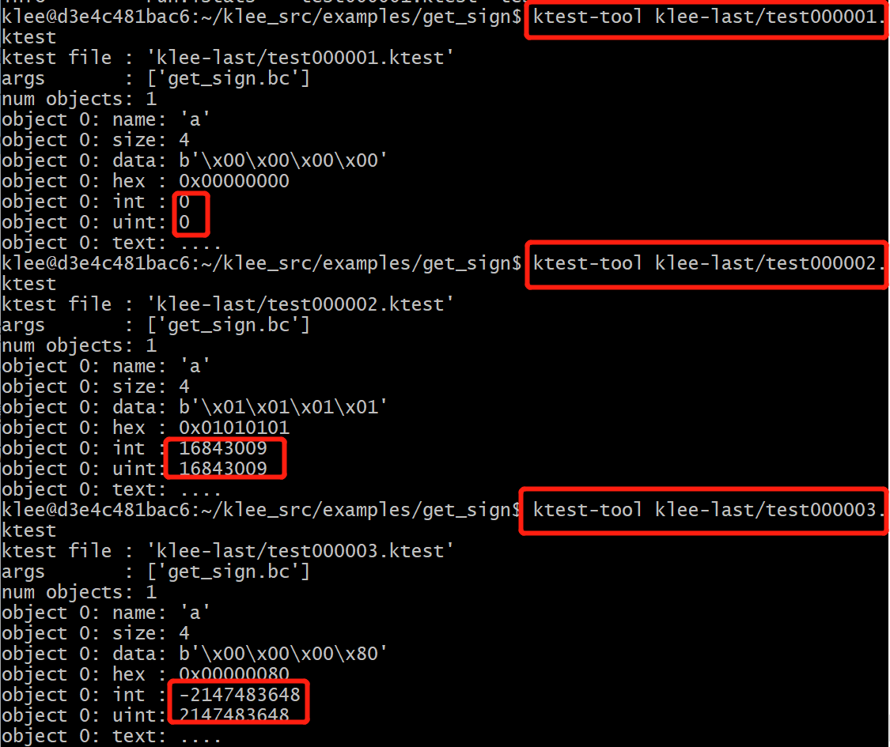
4. Second tutorial: Testing a simple regular expression library.
```
cd klee_src/examples/regexp/

clang -I ../../include -emit-llvm -c -g -O0 -Xclang -disable-O0-optnone Regexp.c

klee --only-output-states-covering-new Regexp.bc
```
运行结果如下图：  
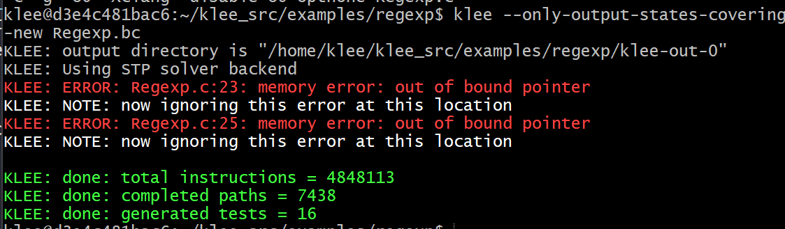
klee总共执行了4848113条指令，探索了7438条路径，生成了16个测试用例。上图红色字样告诉我们23、25行出现了报错，因此查看报错信息。进入相应的output文件夹，可以看到是ptr（存储或加载无效的内存位置）错误，详细如下图所示：  
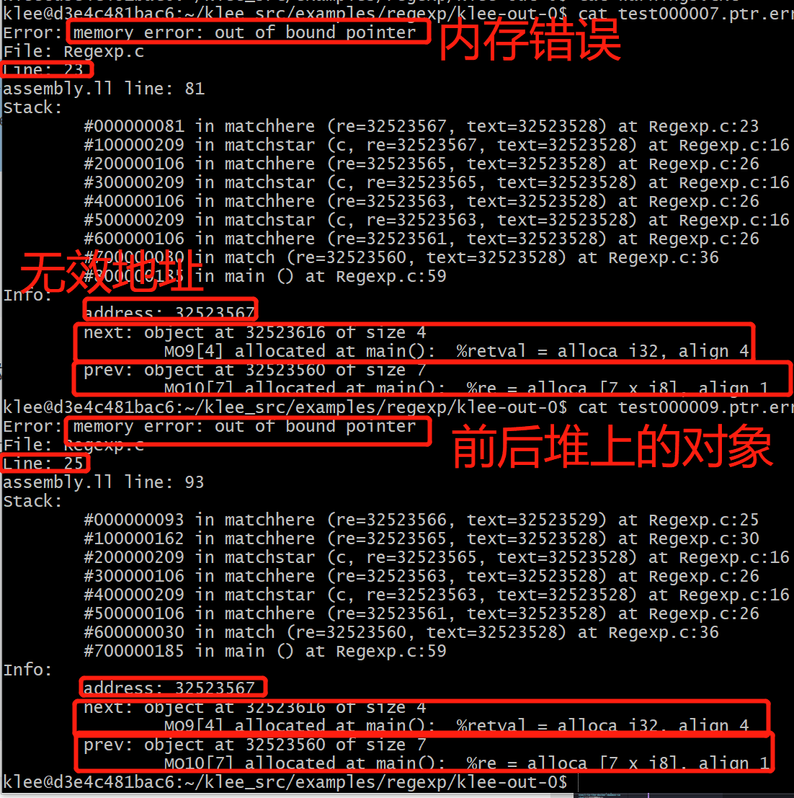
分析：出现内存错误，不是因为正则表达式函数有一个错误，而是按时测试驱动程序有一个错误。因为输入的正则表达式序列完全是符号的，但是match函数期望它是一个以null结尾的字符串。  
解决：将' \0 '符号化后存储在缓冲区的末尾。如图进行修改：
* 也可以增加：klee_assume(re[SIZE - 1] == '\0'); 
* klee_assume接受一个参数(一个无符号整数)，该参数通常应该是某种条件表达式，并且“假定”该表达式在当前路径上为真(如果这种情况永远不会发生，即该表达式可证明为假，那么KLEE将报告错误)。
* klee_assume可以用来编码更复杂的约束。例如，我们可以使用klee_assume(re[0] != '^')使KLEE只探索第一个字节不是'^'的状态。像'&&'和'||'这样的布尔条件可能会被编译成在计算表达式结果之前进行分支的代码。在这种情况下，KLEE将在进程到达对klee_assume的调用之前对进程进行分支，这可能会导致探索不必要的附加状态。出于这个原因，最好使用尽可能简单的表达式来进行klee_assume(例如，将一个调用拆分为多个调用)，并使用'&'和'|'操作符，而不是短路操作符。

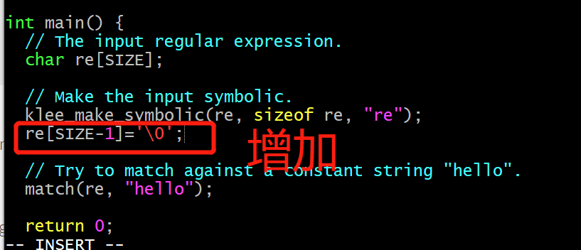 
再次编译链接后运行，发现报错已解决。  
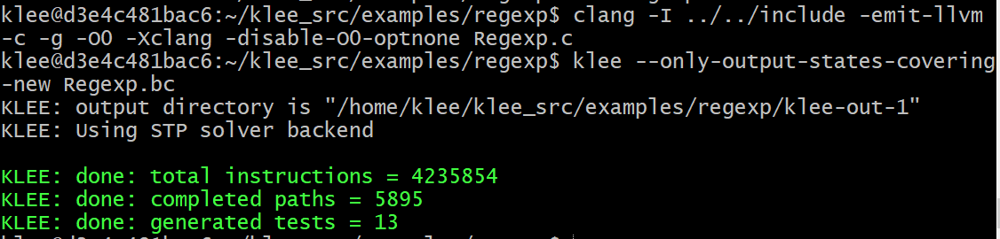
5. tutorial 3:Solving a maze with KLEE
```
# Update aptitude 
sudo apt-get update
# Install git 
sudo apt-get install -y git-core
# Download maze 
git clone https://github.com/grese/klee-maze.git ~/maze


# Build & Run Maze
# Source is in maze.c.
cd ~/maze
# Build 
gcc maze.c -o maze
# Run manually 
./maze 
# Input a string of "moves" and press "enter"
# Allowed moves: w (up), d (right), s (down), a (left)
# Example solution: ssssddddwwaawwddddssssddwwww
#Run w/solution: 
cat solution.txt | ./maze
```
可以看到迷宫一步步的行走结果：  
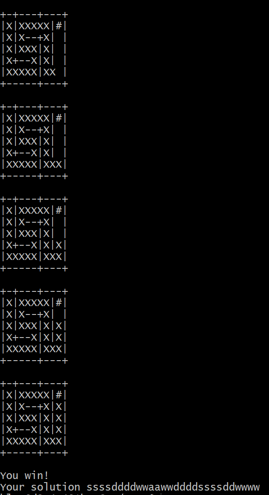  
```
# Build & Run Maze w/Klee
# The maze program using Klee symbolic execution and assertions. When klee evaluates the maze, it will discover the "actual solution", and any "hidden solutions" (which exist due to "bugs" in the maze). 
# Source is in maze_klee.c
cd ~/maze
# Build LLVM Bytecode: 
./scripts/build_bc.sh 
(builds "maze_klee.bc" using "clang -emit-llvm") 
# Ignore the "implicit declaration of function '__assert_fail'" warning.
# Run Klee on Bytecode: 
./scripts/run_klee.sh 
(runs klee on "maze_klee.bc" using "--emit-all-errors")
# Show solutions: 
./scripts/show_solutions.sh 
(gets klee test results from "ktest-tool", and prints maze solutions)
```
klee符号执行的结果,一共有四种可能：  
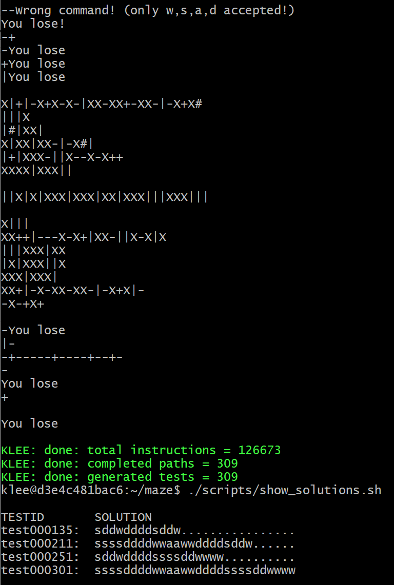
遇见了新的报错类型，查看一下内容： 
* assert: An assertion failed.

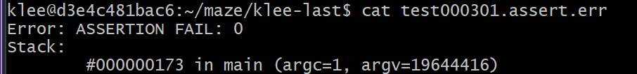
6. tutorial 4:Keygenning with KLEE and Hex-Rays：A beginners explanation of using symbolic execution to solve a small binary’s pseudocode.
>tutorial-4所需代码存于：code/defs.h和main.c

```
# 编译链接
clang -I ~/klee_src/include/ -emit-llvm -g -o main.ll -c main.c  
# 运行
klee --optimize --libc=uclibc --posix-runtime main.ll --sym-arg 100
```
运行结果如下图：  
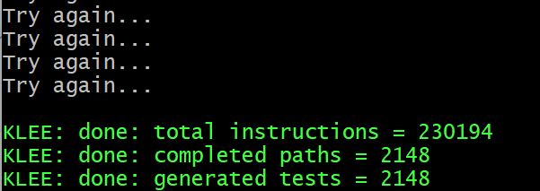
分析结果：  
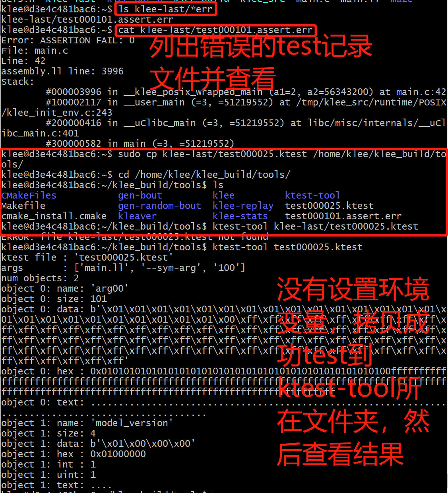
可以看到'data'中的值就是正确的password  
7. tutorial 5:Keygenning With KLEE: A more in-depth guide to using KLEE to solve larger binaries.
>tutorial-5所需代码存于：code/test.c 

```
clang -I ~/klee_src/include/ -emit-llvm -g -o test.ll -c test.c
klee test.ll
```
运行结果如下图：  
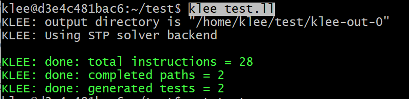    
查看测试用例：  
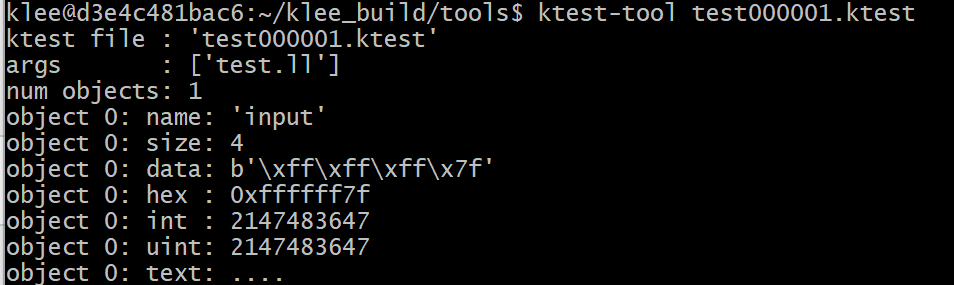  
更改test.c  

再次编译连接后运行，出现了assert报错。  
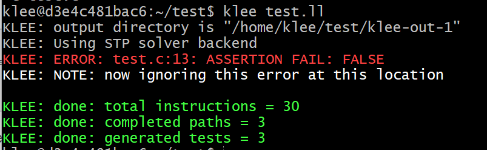  
查看.err错误文件  
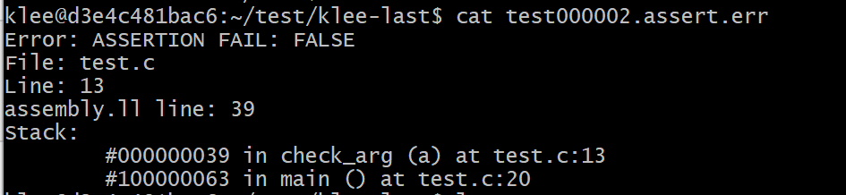  
再查看响应出现错误的那个测试用例，由于我们一开始去掉了=10的情况，所以数值为10的测试用例出现了报错  
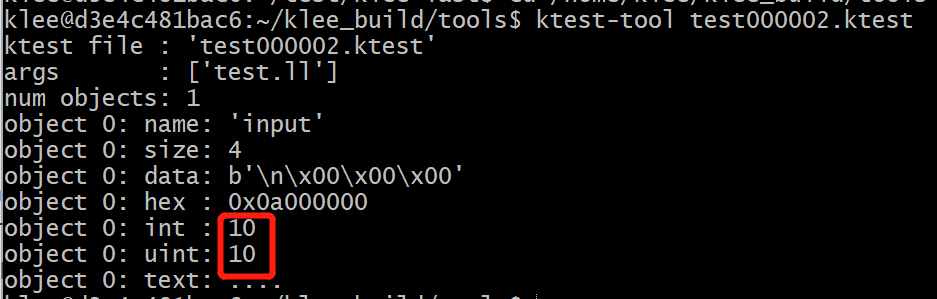  
>code/magic.c

编译链接运行后，测试用例的结果如下图，符合要求'-254'  
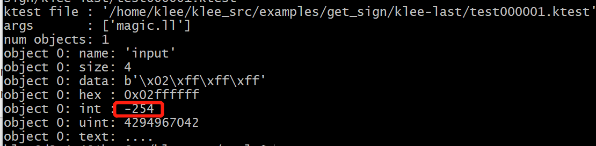
>code/atoi.c

运行结果如下图，出现了报错以后，去解决这个问题，运行时使用```klee --optimize --libc=uclibc --posix-runtime atoi.ll --sym-args 0 1 3```：
* --optimize:这是为了消除死代码。在处理重要应用程序时使用这个标志实际上是一个好主意，因为它加快了速度;
* --libc=uclibc and --posix-runtime:这些是前面提到的uclibc和POSIX运行时的选项;
* --sym-args 0 1 3:这个标志告诉KLEE运行长度为3的最小0和最大1个参数的程序，并使这些参数具有符号性。

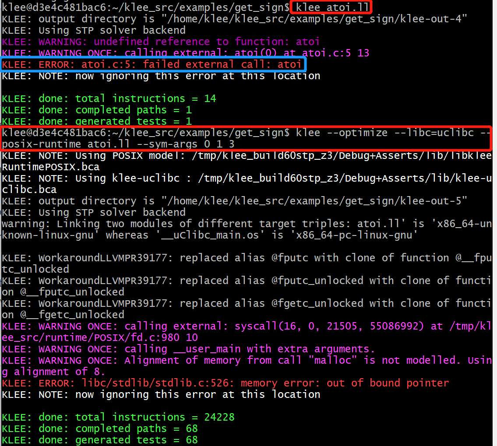
出现了内存错误，atoi.c修改为如下：  
```
#include <stdlib.h>
#include <assert.h>
#include <klee/klee.h>

int main(int argc, char* argv[]) {
        int result = argc > 1 ? atoi(argv[1]) : 0;
        if (result == 42)
            klee_assert(0);
        return result;
    }
```
编译链接命令不变，使用此命令执行```klee --optimize --libc=uclibc --posix-runtime atoi2.ll --sym-args 0 1 3```,运行结果如下图，出现了报错。  
  
找到出错的文件，然后查看对应的测试用例，得到答案是'+42'  
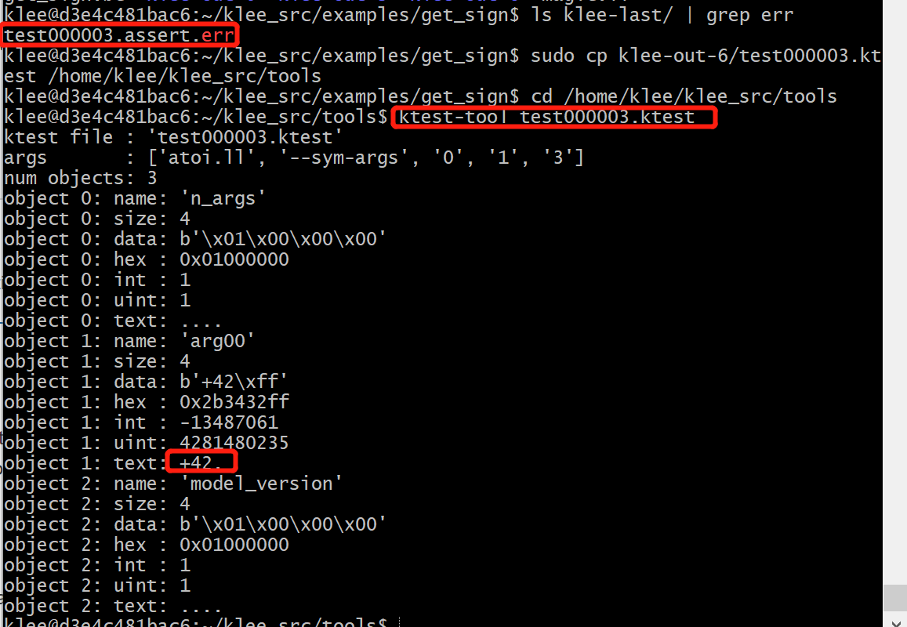 
* 之后的实验需要配合文中的软件因此就做到了这里
8. tutorial 6:Testing Coreutils: In-depth description of how to use KLEE to test GNU Coreutils.

9. tutorial 7:Using symbolic environment: Guide with examples on how to use the symbolic environment such as symbolic files and command-line arguments for the program under test. 
* 熟悉命令行参数

-symm-arg <N>为被测试程序提供了长度为N的命令行参数。它的变体-symg-args <MIN> <MAX> <N>提供了至少最小的参数和最多的最大符号参数，每个参数的最大长度为N.    
>code/password.c 
```
$ clang -c -g -emit-llvm password.c
# 使用-posix-runtime来启动符号环境
$ klee -posix-runtime password.bc -sym-arg 5
```
运行结果如下图：  
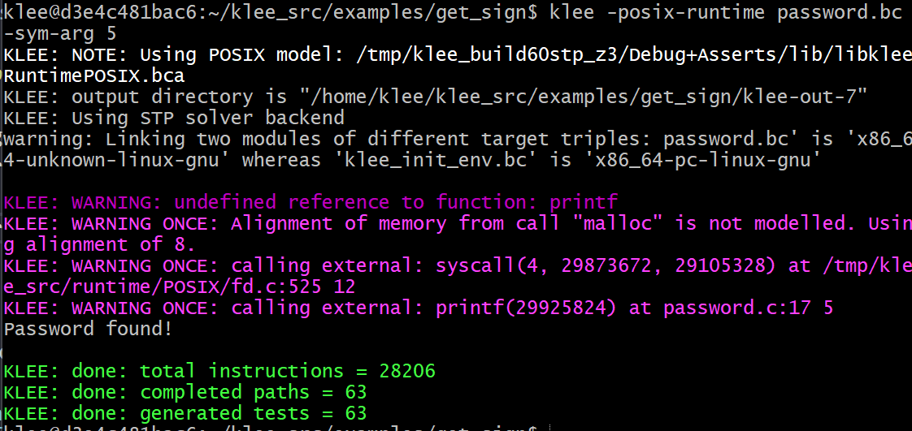  
-symm-files <NUM> <N>创建NUM符号文件，其中第一个文件名为' A '，第二个文件名为' B '，以此类推，每个文件的大小为N。它的兄弟选项- symm -stdin和- symm -stdout分别使标准输入和输出成为符号。  

>code/password2.c
```
$ clang -c -g -emit-llvm password2.c
# 使用-symm-stdin选项提供了一个符号标准输入.
$ klee -posix-runtime password2.bc -sym-stdin 10
```
可以看搭配使用klee的密码是'46561952'.  
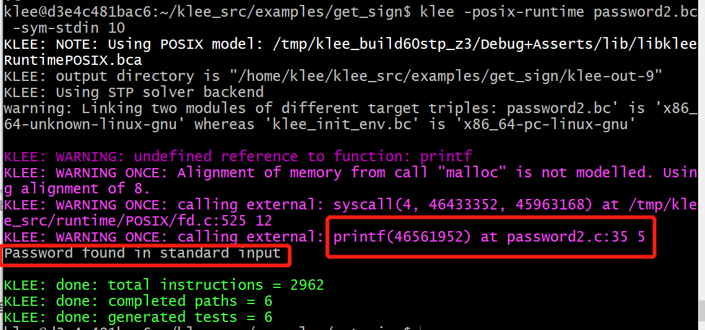   
还可以读取一个包含符号内容的文件，以便KLEE执行密码检查成功的路径。-symm-files选项提供了几个名为“A”、“B”、“C”等文件。通过指定下面的选项-symm-files 1 10，要求KLEE提供一个大小为10字节的符号文件，该文件被KLEE命名为' A '。
```
klee -posix-runtime password2.bc A -sym-files 1 10
```
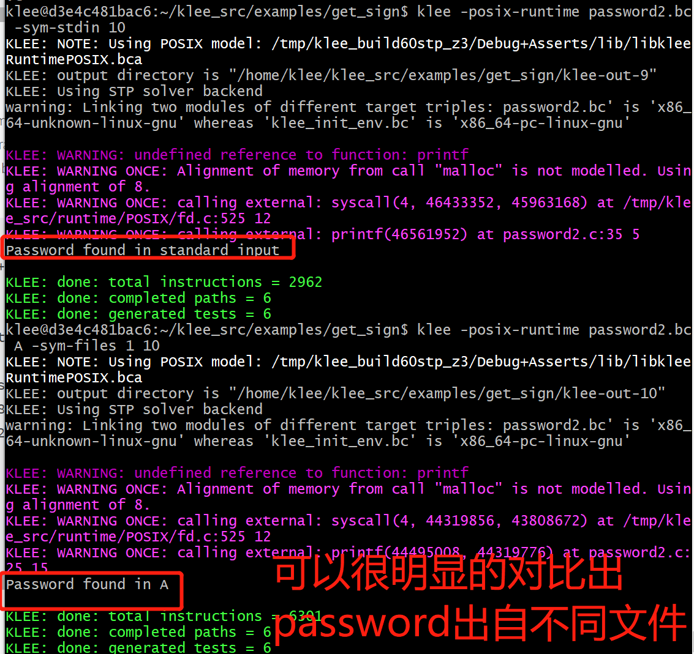 
## 实验问题
1. 安装docker-ce时指定版本出错  
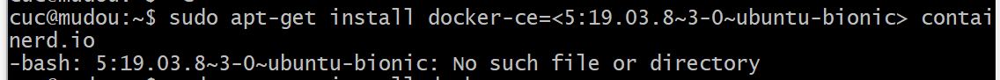    
解决：不指定序列号，直接安装。  
2. 创建klee的docker镜像出错
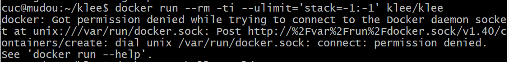  
解决：[解决办法](https://www.digitalocean.com/community/questions/how-to-fix-docker-got-permission-denied-while-trying-to-connect-to-the-docker-daemon-socket)，详细如下：  
```
# Create the docker group.
sudo groupadd docker
# Add your user to the docker group.
sudo usermod -aG docker ${USER}
Y# ou would need to loog out and log back in so that your group membership is re-evaluated or type the following command:
su -s ${USER}
# Verify that you can run docker commands without sudo.
docker run hello-world
```
3. 【tutorial-1】编译链接.c文件时出现报错  
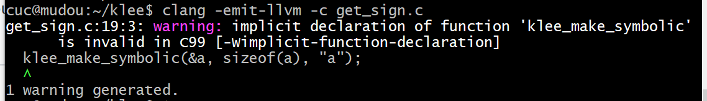  
解决：进错了目录，应该是'klee/examples/get_sign/',然后再编译链接。
4. 【tutorial-2】修改.c文件时，使用vi/vim报错，因为docker容器中vim无法使用  
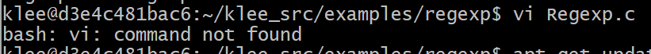  
解决：```sudo apt-get update && sudo apt-get install vim```
5. 【tutorial-4】编译链接时报错，因为缺少IDA插件中的defs.h  
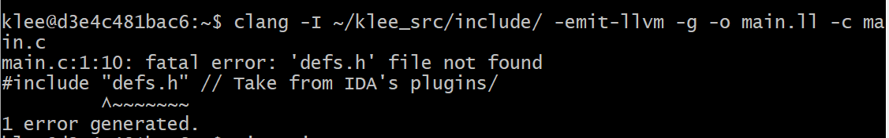  
解决：将[defs.h](https://github.com/nihilus/hexrays_tools/blob/master/code/defs.h)添加到main.c同目录下再编译链接。
## 实验总结
1. klee error report:  
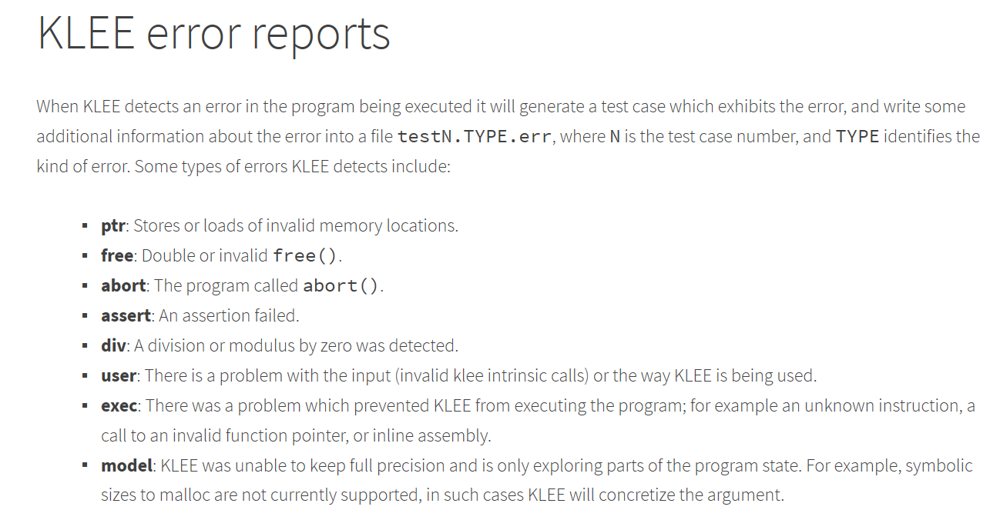
## 参考文献
[klee-tutorials](https://klee.github.io/tutorials/)  
[Get Docker Engine - Enterprise for Ubuntu](https://docs.docker.com/ee/docker-ee/ubuntu/)  
[Using KLEE with Docker](https://klee.github.io/docker/)  
[klee-maze-github](https://github.com/grese/klee-maze)  

