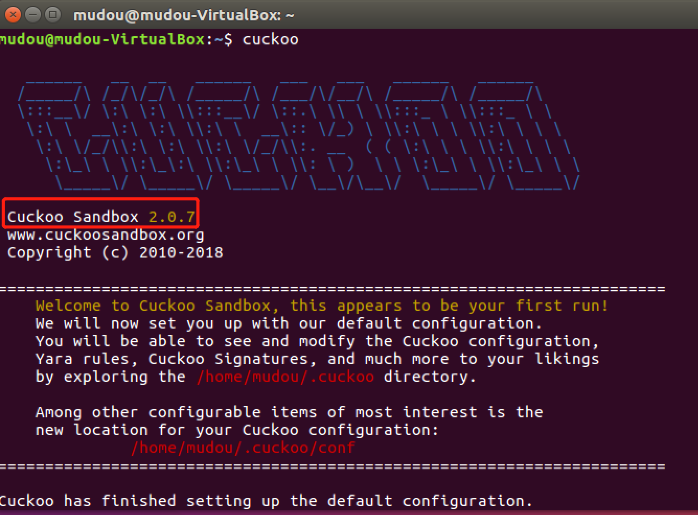
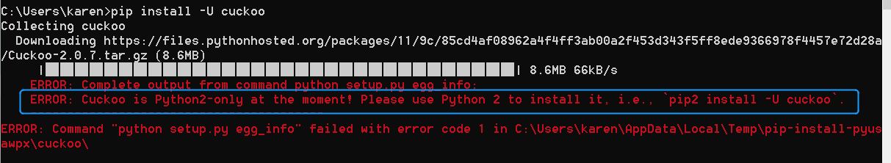
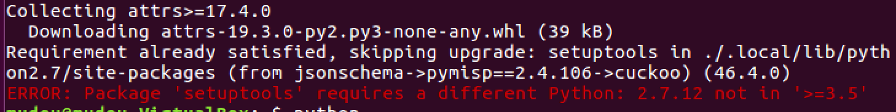

# cuckoo
## 实验要求
- [] 安装并使用cuckoo
- [] 任意找一个程序，在cuckoo中trace获取软件行为的基本数据。
## 实验环境
ubuntu 16.04 desktop
## 实验步骤
1. 安装cuckoo  

```
# 安装依赖
$ sudo apt-get install python python-pip python-dev libffi-dev libssl-dev
$ sudo apt-get install python-virtualenv python-setuptools
$ sudo apt-get install libjpeg-dev zlib1g-dev swig
# 以下依赖选择安装
# 由于本次实验要用到web,因此需要安装mongodb
$ sudo apt-get install mongodb


$ sudo apt-get install postgresql libpq-dev
$ sudo apt-get install qemu-kvm libvirt-bin ubuntu-vm-builder bridge-utils python-libvirt
$ sudo pip install XenAPI

# 安装cuckoo
$ sudo pip install -U pip setuptools
$ sudo pip install -U cuckoo
# 启动cuckoo
cuckoo
# 查看帮助
cuckoo --help
```
看到如下页面说明安装成功  
  
2. 
```
# 开启mongodb
sudo systemctl enable mongodb
sudo systemctl start mongodb
```
## 实验问题
1. win10不可直接安装cuckoo  
  
因为现在的cuckoo只支持python2，因此只有在win10上使用ubuntu系统或者虚拟机的方式，不可直接安装使用。
2. 执行pip install -U cuckoo时出现报错  
    
解决：[解决参考：解决 Package 'setuptools' requires a different Python: 2.7.12 not in '>=3.5' 问题](https://blog.csdn.net/weixin_43350700/article/details/104597730)    
之后又出现这样的报错  
  
解决：没有好好读文档，先安装依赖
## 实验总结
## 参考文献
[cuckoosandbox](https://cuckoosandbox.org/)  
[Introduction](https://cuckoo.readthedocs.io/en/latest/introduction/)