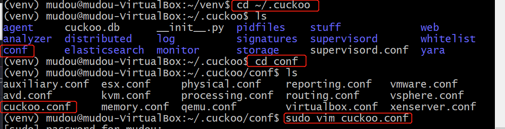
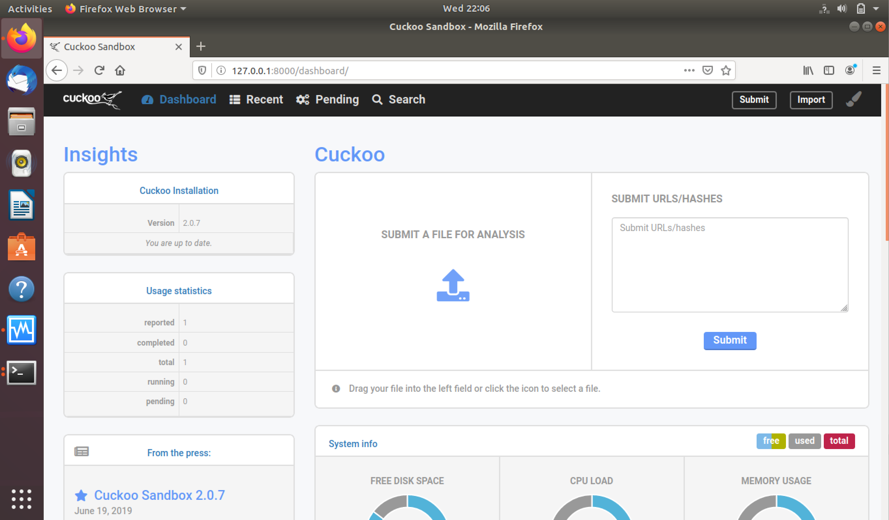
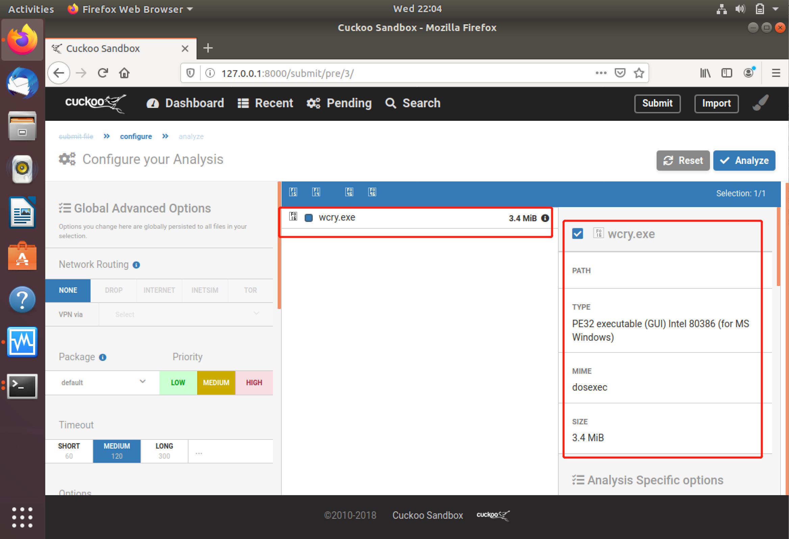
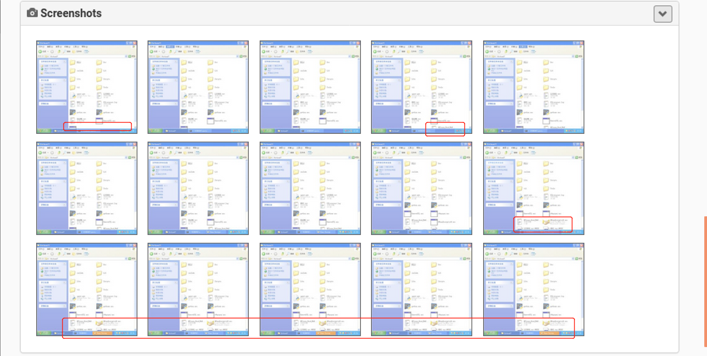
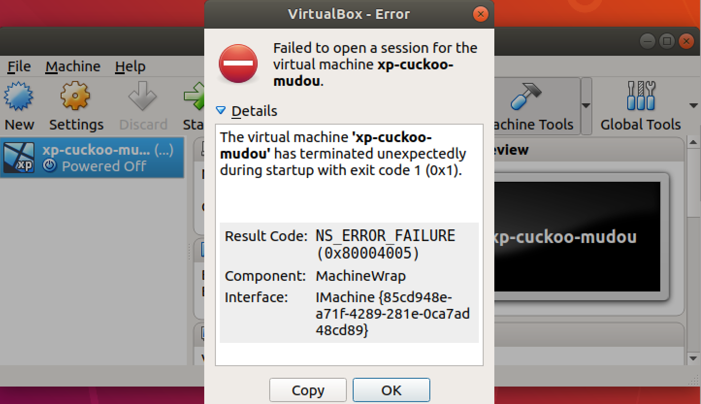

# cuckoo
## 实验要求
- [x] 安装并使用cuckoo
- [x] 任意找一个程序，在cuckoo中trace获取软件行为的基本数据。
## 实验环境
物理机：win10  
host：ubuntu 18.04 LTS    
* 双网卡：NAT+HOST-ONLY(物理机与host连接)  

guest: windows xp-professional    
* 单网卡：host-only(host与guest连接)   

* 使用了一个三层嵌套的配置，虽然guest用virtualbox直接创建，并设置为和Host同一个host-only也可以通信，但是这样不够安全。
## 实验步骤

### 宿主机HOST准备 
#### 1. 安装依赖
* 本次实验安装了:所有相关的python libraries,volatility,tcpdump,M2Crypto,guacd.没有安装virtual environment
* [Volatility](https://github.com/volatilityfoundation):内存取证工具,结合cuckoo,分析更深度与全面，可以防止恶意软件利用rookit技术逃逸沙箱。要根据python的版本进行选择安装。
* [M2Crypto](https://pypi.org/project/M2Crypto/)
* [guacamole/guacd](https://hub.docker.com/r/guacamole/guacd):guacd is the native server-side proxy used by the Apache Guacamole web application.
* [pydeep](https://pydeep.readthedocs.io/en/latest/welcome.html):PyDeep is a machine learning / deep learning library with focus on unsupervised learning. 
* [virtualenv](https://pan.baidu.com/s/1Zf7xJSG4WFmPKXEdt1rguQ):A tool for creating isolated virtual python environments.
```
# 官网要求安装的依赖
$ sudo apt-get install python python-pip python-dev libffi-dev libssl-dev
$ sudo apt-get install python-virtualenv python-setuptools
$ sudo apt-get install libjpeg-dev zlib1g-dev swig
$ sudo apt-get install mongodb
$ sudo apt-get install postgresql libpq-dev
$ sudo apt-get install qemu-kvm libvirt-bin ubuntu-vm-builder bridge-utils python-libvirt
$ sudo pip install XenAPI
# 以上步骤发现官方指南安装的依赖不够，还需要本次实验要用的依赖：
sudo apt-get install git mongodb libffi-dev build-essential python-django python python-dev python-pip python-pil python-sqlalchemy python-bson python-dpkt python-jinja2 python-magic python-pymongo python-gridfs python-libvirt python-bottle python-pefile python-chardet tcpdump -y

# 本次实验没有使用virtual software,跳过此步
# install virtual software
$ echo deb http://download.virtualbox.org/virtualbox/debian xenial contrib | sudo tee -a /etc/apt/sources.list.d/virtualbox.list
$ wget -q https://www.virtualbox.org/download/oracle_vbox_2016.asc -O- | sudo apt-key add -
$ sudo apt-get update
$ sudo apt-get install virtualbox-5.1

# install Tcpdump
sudo apt-get install tcpdump apparmor-utils
sudo aa-disable /usr/sbin/tcpdump
# to make sure it is correctly installed 
sudo setcap cap_net_raw,cap_net_admin=eip /usr/sbin/tcpdump
getcap /usr/sbin/tcpdump
# right output:
# /usr/sbin/tcpdump = cap_net_admin,cap_net_raw+eip

# install Volatility(optional and not be installed this time)
sudo pip install openpyxl ujson pycrypto distorm3 pytz
git clone https://github.com/volatilityfoundation/volatility.git
cd volatility
python setup.py build
python setup.py install
# 确认volatility安装无误
python vol.py -h
# Output:Volatility Foundation Volatility Framework 2.6.1

# install M2Crypto(optional)
$ sudo apt-get install swig
$ sudo pip install m2crypto==0.24.0

# install guacd(optional)
$ sudo apt install libguac-client-rdp0 libguac-client-vnc0 libguac-client-ssh0 guacd

# install pydeep
wget http://sourceforge.net/projects/ssdeep/files/ssdeep-2.13/ssdeep-2.13.tar.gz/download -O ssdeep-2.13.tar.gz
tar -zxf ssdeep-2.13.tar.gz
cd ssdeep-2.13
./configure
make
sudo make install
# 确认pydeep安装无误：
#检查版本
ssdeep -V 
#再安装一次看看会不会提示已安装
pip show pydeep  
# output:2.13
```
* volatility版本信息：

* pydeep版本信息：  
  
#### 2. 安装cuckoo
* 第一次直接安装很顺畅，第二次使用官网推荐的(可选但推荐就试了试)虚拟机内安装，安装后出现太多报错。无奈之后很多次报错，最后只好直接安装。
* [KVM](https://help.ubuntu.com/community/KVM)

```
# 如果没有安装依赖，安装以下依赖
sudo apt-get install libtiff5-dev libjpeg8-dev zlib1g-dev libfreetype6-dev liblcms2-dev libwebp-dev tcl8.6-dev tk8.6-dev python-tk

# 本次实验没有增加新的用户，跳过此步
# add user
$ sudo adduser cuckoo
# If you’re using VirtualBox, make sure the new user belongs to the “vboxusers” group (or the group you used to run VirtualBox):
$ sudo usermod -a -G vboxusers cuckoo
#If you’re using KVM or any other libvirt based module, make sure the new user belongs to the “libvirtd” group (or the group your Linux distribution uses to run libvirt):
$ sudo usermod -a -G libvirtd cuckoo

# 本次实验没有使用virtualenv，跳过此步
# install cuckoo 
$ virtualenv venv
$ . venv/bin/activate
(venv)$ pip install -U pip setuptools
(venv)$ pip install -U cuckoo

# 如果不再虚拟环境下安装，使用如下命令安装
pip install -U pip setuptools
pip install -U cuckoo

# 启动cuckoo
cuckoo 或 cuckoo -d
# 查看帮助
cuckoo --help
```
#### 3. 启动cuckoo  
第一次启动cuckoo看到如下页面说明安装成功,版本是2.0.7,CWD目录为'home/mudou/.cuckoo'.

* CWD的具体路径默认是在当前用户目录下 ~/.cuckoo.配置文件在$CWD/conf目录下,CWD的具体路径可更改。
* 这里总结三次错误，是因为反复安装了几次的过程中发现无论是否用virtual environment，一定有这三步

     
第二次启动看到如下报错：      
    
进入到工作目录下修改配置文件cuckoo.conf:    
  
设置ignore_vulnerabilities = yes    
 
第三次启动cuckoo,看到如下'报错'，是正常的，因为我们还没有配置相关的文件。    
   

### 客户机准备
#### 1. ubuntu内部安装virtualbox  
```sudo apt-get install virtualbox```  

#### 2. 拷贝iso镜像到ubuntu中
* 拷贝方法一：ubuntu安装增强功能将windows-xp镜像从物理机拖拽到Ubuntu中(镜像为：zh-hans_windows_xp_professional_with_service_pack_3_x86_cd_x14-80404.iso。之前就有，此处没给链接)
* 拷贝方法二：scp

#### 3. 设置virtualbox
virtualbox新建虚拟机  

virtualbox左上角file---host network manager中增加一个Host only网络并取消勾选enable dhcp server

* 虚拟机增加host-only网段以后，看到ubuntu的网络确实有两个不同host-only的ipv4地址。并且vboxnet0只有当ubuntu内xp启动后才会增加。  
 

#### 4. 安装xp
启动虚拟机并安装
* 只有一块网卡host-only哟~
* 在安装的时候不打开防火墙。安装完之后，xp系统右下角的那个红色盾牌，确保防火墙、自动更新、病毒保护这三项全部关掉，防火墙不关掉的话，在之后配置了端口转发后，Ubuntu无法ping通xp


安装好以后,xp没有ip地址，xp无上网，ubuntu与xp无法ping通


#### 5. xp本地网络设置
网上邻居---查看本地连接---本地连接属性---常规---Internet协议（TCP/IP）---属性.具体设置如下图：  

进行设置以后，xp与ubuntu能够ping通，xp无法上网
  

##### 6. ubuntu-IP转发设置
```
# 开启IP转发
sudo -i
sysctl -w net.ipv4.ip_forward=1
echo 1 > /proc/sys/net/ipv4/ip_forward
#为使重启之后仍然有效
sudo vim /etc/sysctl.conf
# 去掉net.ipv4.ip_forward=1 前的#号，保存
sysctl -p /etc/sysctl.conf
```
/etc/sysctl.conf修改如下图  


* [iptables](https://linux.die.net/man/8/iptables)
```
iptables -L
配置Iptables的规则：
# 看下有没有其他的防火墙规则，
iptables -L
iptables -A FORWARD -o eth0 -i vboxnet0 -s 192.168.56.0/24 -m conntrack --ctstate NEW -j ACCEPT
iptables -A FORWARD -m conntrack --ctstate ESTABLISHED,RELATED -j ACCEPT
iptables -A POSTROUTING -t nat -j MASQUERADE
# 接着为保证重启之后依然有效


#在最后添加两行
pre-up iptables-restore < /etc/iptables.rules 
post-down iptables-save > /etc/iptables.rules
```
/etc/network/interfaces设置如下图：  
  
iptables规则设置以后，xp浏览器和终端都可上网；Ubuntu终端可上网，浏览器不可上网。
  
临时更改nameserver让Ubuntu能上网```sudo vim /etc/resolv.conf```，不可重启网络。  

* [nameserver永久解决办法参考一](https://www.helplib.com/ubuntu/article_162736)+[nameserver永久解决办法参考二](https://blog.csdn.net/weixin_33920401/article/details/87407103)
#### 7. ubuntu与xp之间创建共享文件夹
```
# 创建共享文件夹share
cd /home/用户名/
mkdir share
cd share
# 在share文件夹下，下载Python2安装包和PIL安装包,以及将agent.py拷贝到share文件夹下
cp ~/.cuckoo/agent/agent.py /home/mudou/share
wget https://www.python.org/ftp/python/2.7.13/python-2.7.13.msi
wget http://effbot.org/media/downloads/PIL-1.1.7.win32-py2.7.exe
```
xp安装增强功能，并将share文件夹添加到共享文件夹中。  
  
重启后打开'我的电脑'，看到多了一个'网络驱动器'。点进去,先安装python2.7后安装PIL。   
    
[显示文件扩展名](https://blog.csdn.net/cduan/article/details/8802873),将agent.py后缀改成agent.pyw。  

* 后来反思发现非常笨，应该在Linux上命令行更改，多方便。

将agent.pyw复制到C:\Python27\文件夹下，双击运行（是没有任何反应的）。  

* C:\Python27\是安装python和PIL的默认文件夹

  
打开cmd，输入netstat -an，查看本地8000端口没有在监听  
* 8000必须要在监听状态下，之后的样本分析才能连接成功


xp增加快照。
* 再次强调快照的时候8000必须在监听状态下快照
* 可以将最后的页面切换到C:/Python27/的文件路径下，以便样本分析的时候screenshot
### cuckoo配置
```
cd ~/.cuckoo/conf
# 在 .cuckoo/conf/中修改配置文件：


# cuckoo.conf
sudo vim cuckoo.conf
machinery = virtualbox
[resultserver]
ip = 192.168.56.1 #This is the IP address of the host
port = 2042 #leave default unless you have services running


# auxiliary.conf
# sudo vim auxiliary.conf
[sniffer]
# Enable or disable the use of an external sniffer (tcpdump) [yes/no].
enabled = yes
# Specify the path to your local installation of tcpdump. Make sure this
# path is correct.
tcpdump = /usr/sbin/tcpdump


# virtualbox.conf
sudo vim virtualbox.conf
machines = 虚拟机名字

[虚拟机名字]
label = 虚拟机名字
platform = windows
ip = 192.168.56.101 # IP address of the guest
snapshot = 快照名字
interface = vboxnet0

# reporting.conf 
sudo vim reporting.conf:
[mongodb]
enabled = yes
# 也许还有其他要改的，但是这个最重要，其他是yes还是no更多的是看你的需要，或者之后在使用时再来配置文件里面打开
```
* 配置的时候一定要看清楚

virtualbox.conf的完整配置如下图：  


### 启动cuckoo
1. 避免一些报错的必要设置
```
# 在安装tcpdump的时候就以及解决了权限问题，这里如果出现报错'Unable to stop auxiliary module: Sniffer'，再执行一遍
sudo apt-get install apparmor-utils
sudo aa-disable /usr/sbin/tcpdump

cd ~/.cuckoo/analyzer/windows/modules/auxiliary
sudo vim recentfiles.py
# 注释以下代码段，避免'AttributeError: function 'SHGetKnownFolderPath' not found'报错
   r = SHELL32.SHGetKnownFolderPath(
         uuid.UUID(self.locations[location]).get_bytes_le(),
         0, None, ctypes.byref(dirpath)
     )
   if r:
         log.warning("Error obtaining user directory: 0x%08x", r)
         return
```
* ['AttributeError: function 'SHGetKnownFolderPath' not found'报错解决参考](https://github.com/cuckoosandbox/cuckoo/issues/1934) 

recentfiles.py更改如下图：  
 
2.  运行cuckoo  
打开两个终端，一个先输入cuckoo -d，另一个再输入cuckoo web runserver，接着用浏览器打开127.0.0.1:8000登录到cuckoo的web服务页面。   
* cuckoo命令行运行成功页面：  
  
cuckoo浏览器访问成功页面：  
  

### 恶意分析并提交样本
#### 1. 下载病毒样本到Ubunutu中，解压缩得到.exe文件
* [Enternal blue下载](https://bbs.pediy.com/thread-217586.htm)
#### 2. 访问浏览器，提交样本并分析  
  
#### 3. 分析结果  
  
  
分析的screenshots比较清晰的截图,虽然很小，但是可以看到多了文件    
  
* 第二次成功实验时的screenshots  
  

再次启动xp系统,看到被Enternal blue攻击过的xp
* 记得用快照恢复~第一次就忘了，又重新安装一遍:sob:


由于永恒之蓝最明显就是通过445来上传文件，查看命令行，445端口确实是监听状态。   
  
ubuntu端运行了cuckoo -d的终端也记录了样本上传文件的行为  
 
* 想要上交抓的包，但是太大了无法上传~

实验就到此结束啦！！！完结！撒花！:tada::tada::tada:
## 实验视频
[在线视频](https://www.bilibili.com/video/BV1Zp4y1D78J)
* 视频太大，Github上没有上传~
## 实验问题
1. win10不可直接安装cuckoo  
  
因为现在的cuckoo只支持python2，因此只有在win10上使用ubuntu系统或者虚拟机的方式，不可直接安装使用。
2. 执行pip install -U cuckoo时出现报错  
    
解决：[解决参考：解决 Package 'setuptools' requires a different Python: 2.7.12 not in '>=3.5' 问题](https://blog.csdn.net/weixin_43350700/article/details/104597730)    
之后又出现这样的报错  
  
解决：没有好好读文档，先安装依赖
3. 没有安装ssh，报错：'ssh: connect to host localhost port 22: Connection refused'  
解决：  
```
# install
sudo apt-get install openssh-server 
# start
sudo /etc/init.d/ssh start  
# see stauts
ps -e|grep ssh 
# change port
vim /etc/ssh/sshd_config
```
4. 第二次安装了虚拟机后启动cuckoo出现了:  
'Vulnerable dependencies found
--> Vulnerable version of virtualbox installed (5.1.38). It is highly recommended to update. Please update and restart Cuckoo. Recommended version: >=5.2.28'  
  
解决：[Cuckoo Sandbox 2.0.7](https://cuckoosandbox.org/blog/207-interim-release/) 
进入到工作目录下修改配置文件cuckoo.conf:  
  
设置ignore_vulnerabilities = yes  
  
出现报错'CuckooCriticalError: Unable to bind ResultServer'  
  
参考[FAQ](https://cuckoo.sh/docs/faq/#troubles-problem),执行：  
```
# If the hostonly interface vboxnet0 does not exist already.
$ VBoxManage hostonlyif create

# Configure vboxnet0.
$ VBoxManage hostonlyif ipconfig vboxnet0 --ip 192.168.56.1 --netmask 255.255.255.0
```
再次启动cuckoo,出现报错'CuckooCriticalError: Please update your configuration.'：  

但是出现这样的错误是因为此时还没有修改配置文件进行修改，并不是真的错，因此解决到这里，之后更改了配置就没有这个错了。

5. 一开始使用ubuntu16.04来做实验，之后更换了虚拟机，新的虚拟机安装ssh.(再写一遍加深记忆)  
解决：```sudo apt-get install openssh-server``` 

6. 运行cuckoo时，command not found报错  
  
解决：如上图所示。执行```cp  /home/(username)/.local/bin/cuckoo  /usr/local/bin```以后再次运行，看到成功。

7. 更改配置后运行cuckoo -d出现报错  
* 前两个报错在解决8以后进行了解决  

    
问题8解决以后的报错信息：'CuckooStartupError: You have filled out the Cuckoo Feedback configuration, but there's an error in it: Missing contact name'.  
   
解决：根据错误提示信息，说明是配置出了问题，就将配置过的文件都重新仔细地对照一遍配置，发现是自己粗心少配且配错了。  
我的错误配置：  
reporting.conf错误配置：      
  
reporting.conf配置更正：  
    
virtualbox.conf错误配置:  
  
virtualbox.conf更正配置后完整配置:  
   

8. xp运行状态下，ubuntu突然重启后，再次运行xp，出现两个弹窗的报错。
      
    
解决：[参考](https://www.ostechnix.com/how-to-fix-kernel-driver-not-installed-rc-1908-virtualbox-error-in-ubuntu/)  
```
sudo apt upgrade
sudo apt install virtualbox-dkms
```

9. xp运行报错'VERR_SSM_LOAD_CPUID_MISMATCH'    
 
解决：参考[cannot resume saved virtualbox state](https://stackoverflow.com/questions/46775652/cannot-resume-saved-virtualbox-state)，点击上方的'Discard'删除虚拟机保存的状态，再启动。     

10. 提交了样本以后出现了报错,样本分析后的结果0.0，浏览器分析结果提示也是没有连接上。       
    
  

解决：删除原有的快照，运行agent.py，打开命令行，确认8000端口是监听状态后快照，关闭虚拟机，再次运行cuckoo，添加样本分析。

* 根据错误信息提示，反思回想自己的操作，想到agent.py没有开，而且又提示试图打开已经拆开的vm。因此想到第一次的操作(同时是问题11)忘了运行agent.py,看到8000端口没有开启，还以为是8000需要添加端口。

11. xp的8000端口没有在监听状态下  
  
添加端口8000：开始---控制面板---网络和Internet连接---网络连接---本地连接属性---高级---设置---例外---添加端口  
* [XP如何在防火墙中打开8000 8001这两个端口](https://answers.microsoft.com/zh-hans/ie/forum/ie7_6-windows_xp/xp如何在防火/9dd89f19-6e58-432c-a020-8304dd5cb611)  
  
## 实验总结
1. cuckoo configuration files
* ~/.cuckoo/conf/
* cuckoo.conf: for configuring general behavior and analysis options.
* auxiliary.conf: for enabling and configuring auxiliary modules.
* <machinery>.conf: for defining the options for your virtualization software (the file has the same name of the machinery module you choose in cuckoo.conf).
* memory.conf: Volatility configuration.
* processing.conf: for enabling and configuring processing modules.
* reporting.conf: for enabling or disabling report formats.

* To get Cuckoo working you should at the very least edit cuckoo.conf and <machinery>.conf.

2. 端口  
* 端口不存在开启或关闭，只有是否有程序运行占用该端口存在是否监听，以及防火墙对该端口有没有过滤转发等操作

根据端口号的数字对端口分类：
* Well Known Ports: those from 0 through 1023.
* Registered Ports: those from 1024 through 49151
* Dynamic and/or Private Ports: those from 49152 through 65535  

well-known port numbers:

* 21: FTP Server
  22: SSH Server (remote login)
  25: SMTP (mail server)
  53: Domain Name System (Bind 9 server)
  80: World Wide Web (HTTPD server)
  110: POP3 mail server
  143: IMAP mail server
  443: HTTP over Transport Layer Security/Secure Sockets Layer (HTTPDS server)
  445: microsoft-ds, Server Message Block over TCP

## 参考文献
[cuckoosandbox](https://cuckoosandbox.org/)  
[Introduction](https://cuckoo.readthedocs.io/en/latest/introduction/)  
[usage](https://cuckoo.readthedocs.io/en/latest/usage/start/)     
[从零开始安装配置Cuckoo sandbox并提交样本进行分析](https://www.cnblogs.com/BenjaminNL/p/11139517.html)

