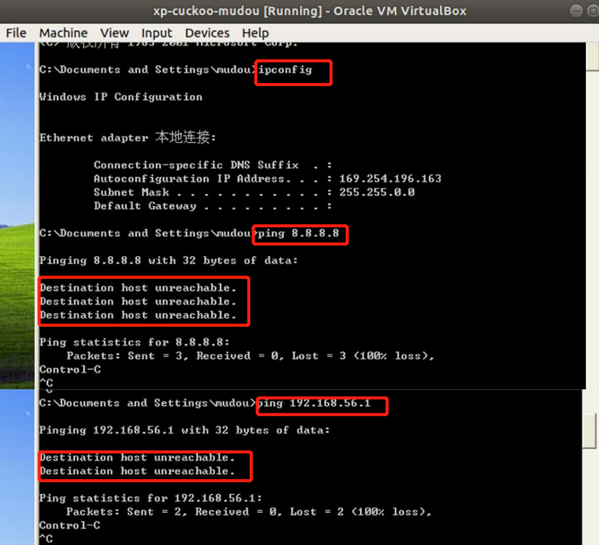

# cuckoo
## 实验要求
- [] 安装并使用cuckoo
- [] 任意找一个程序，在cuckoo中trace获取软件行为的基本数据。
## 实验环境
物理机：win10  
host：ubuntu 18.04 LTS    
* 双网卡：NAT+HOST-ONLY(物理机与host连接)  

guest: windows xp-professional    
* 单网卡：host-only(host与guest连接)   

* 使用了一个三层嵌套的配置，虽然guest用virtualbox直接创建，并设置为和Host同一个host-only也可以通信，但是这样不够安全。
## 实验步骤

### 宿主机HOST准备
#### 一、 安装cuckoo  
1. 安装依赖
* 本次实验安装了:所有相关的python libraries,virtualbox,tcpdump,M2Crypto,guacd.没有安装Volatility
* [Volatility](https://github.com/volatilityfoundation):内存取证工具,结合cuckoo,分析更深度与全面，可以防止恶意软件利用rookit技术逃逸沙箱。要根据python的版本进行选择安装。
* [M2Crypto](https://pypi.org/project/M2Crypto/)
* [guacamole/guacd](https://hub.docker.com/r/guacamole/guacd):guacd is the native server-side proxy used by the Apache Guacamole web application.
* [pydeep](https://pydeep.readthedocs.io/en/latest/welcome.html):PyDeep is a machine learning / deep learning library with focus on unsupervised learning. 
* [virtuaenv](https://pan.baidu.com/s/1Zf7xJSG4WFmPKXEdt1rguQ):A tool for creating isolated virtual python environments.
```
# 官网要求安装的依赖
$ sudo apt-get install python python-pip python-dev libffi-dev libssl-dev
$ sudo apt-get install python-virtualenv python-setuptools
$ sudo apt-get install libjpeg-dev zlib1g-dev swig
$ sudo apt-get install mongodb
$ sudo apt-get install postgresql libpq-dev
$ sudo apt-get install qemu-kvm libvirt-bin ubuntu-vm-builder bridge-utils python-libvirt
$ sudo pip install XenAPI
# 以上步骤发现官方指南安装的依赖不够，还需要本次实验要用的依赖：
sudo apt-get install git mongodb libffi-dev build-essential python-django python python-dev python-pip python-pil python-sqlalchemy python-bson python-dpkt python-jinja2 python-magic python-pymongo python-gridfs python-libvirt python-bottle python-pefile python-chardet tcpdump -y

# 本次实验没有使用virtual software
# install virtual software
$ echo deb http://download.virtualbox.org/virtualbox/debian xenial contrib | sudo tee -a /etc/apt/sources.list.d/virtualbox.list
$ wget -q https://www.virtualbox.org/download/oracle_vbox_2016.asc -O- | sudo apt-key add -
$ sudo apt-get update
$ sudo apt-get install virtualbox-5.1

# install Tcpdump
sudo apt-get install tcpdump apparmor-utils
sudo aa-disable /usr/sbin/tcpdump
# to make sure it is correctly installed 
sudo setcap cap_net_raw,cap_net_admin=eip /usr/sbin/tcpdump
getcap /usr/sbin/tcpdump
# right output:
# /usr/sbin/tcpdump = cap_net_admin,cap_net_raw+eip

# install Volatility(optional and not be installed this time)
sudo pip install openpyxl ujson pycrypto distorm3 pytz
git clone https://github.com/volatilityfoundation/volatility.git
cd volatility
python setup.py build
python setup.py install
# 确认volatility安装无误
python vol.py -h
# Output:Volatility Foundation Volatility Framework 2.6.1

# install M2Crypto(optional)
$ sudo apt-get install swig
$ sudo pip install m2crypto==0.24.0

# install guacd(optional)
$ sudo apt install libguac-client-rdp0 libguac-client-vnc0 libguac-client-ssh0 guacd

# install pydeep
wget http://sourceforge.net/projects/ssdeep/files/ssdeep-2.13/ssdeep-2.13.tar.gz/download -O ssdeep-2.13.tar.gz
tar -zxf ssdeep-2.13.tar.gz
cd ssdeep-2.13
./configure
make
sudo make install
# 确认pydeep安装无误：
#检查版本
ssdeep -V 
#再安装一次看看会不会提示已安装
pip show pydeep  
# output:2.13
```
volatility版本信息

pydeep版本：  
  
2. 安装cuckoo
* 第一次直接安装很顺畅，第二次使用官网推荐的(可选但推荐就试了试)虚拟机内安装，安装后出现太多报错。无奈之后很多次报错，最后只好直接安装。
* [KVM](https://help.ubuntu.com/community/KVM)

```
# 如果没有安装依赖，安装以下依赖
sudo apt-get install libtiff5-dev libjpeg8-dev zlib1g-dev libfreetype6-dev liblcms2-dev libwebp-dev tcl8.6-dev tk8.6-dev python-tk

# add user
$ sudo adduser cuckoo
# If you’re using VirtualBox, make sure the new user belongs to the “vboxusers” group (or the group you used to run VirtualBox):
$ sudo usermod -a -G vboxusers cuckoo
#If you’re using KVM or any other libvirt based module, make sure the new user belongs to the “libvirtd” group (or the group your Linux distribution uses to run libvirt):
$ sudo usermod -a -G libvirtd cuckoo

# 本次实验没有使用virtualenv
# install cuckoo 
$ virtualenv venv
$ . venv/bin/activate
(venv)$ pip install -U pip setuptools
(venv)$ pip install -U cuckoo

# 如果不再虚拟环境下安装，使用如下命令安装
pip install -U pip setuptools
pip install -U cuckoo

# 启动cuckoo
cuckoo 或 cuckoo -d
# 查看帮助
cuckoo --help
```
3. 启动cuckoo  
第一次启动cuckoo看到如下页面说明安装成功,版本是2.0.7,CWD目录为'home/mudou/.cuckoo'.

* CWD的具体路径默认是在当前用户目录下 ~/.cuckoo.配置文件在$CWD/conf目录下,CWD的具体路径可更改。

     
第二次启动看到如下报错：    
    
进入到工作目录下修改配置文件cuckoo.conf:  
  
第三次启动cuckoo,看到如下'报错'，是正常的因为我们还没有配置相关的文件。    
 
### 客户机准备
#### 安装虚拟机
1. ubuntu内部安装virtualbox  
```sudo apt-get install virtualbox```  

2. 拷贝iso镜像到ubuntu中
* 拷贝方法一：ubuntu安装增强功能将windows-xp镜像从物理机拖拽到Ubuntu中(镜像为：zh-hans_windows_xp_professional_with_service_pack_3_x86_cd_x14-80404.iso。之前就有，此处没给链接)
* 拷贝方法二：scp


3. 设置virtualbox
virtualbox新建虚拟机  

virtualbox左上角file---host network manager中增加一个Host only网络并取消勾选enable dhcp server

* 虚拟机增加host-only网段以后，看到ubuntu的网络确实有两个不同host-only的ipv4地址
 

4. 安装xp
启动虚拟机并安装
* 只有一块网卡host-only哟~
* 在安装的时候不打开防火墙。安装完之后，xp系统右下角的那个红色盾牌，确保防火墙、自动更新、病毒保护这三项全部关掉，防火墙不关掉的话，在之后配置了端口转发后，Ubuntu无法ping通xp


安装好以后,xp没有ip地址，xp无上网，ubuntu与xp是无法ping通


5. xp本地网络设置
网上邻居---查看本地连接---本地连接属性---常规---Internet协议（TCP/IP）---属性.具体设置如下图：  

进行设置以后，xp与ubuntu能够ping通，xp无法上网
  

6. ubuntu-IP转发设置
```
# 开启IP转发
sudo -i
sysctl -w net.ipv4.ip_forward=1
echo 1 > /proc/sys/net/ipv4/ip_forward
#为使重启之后仍然有效
sudo vim /etc/sysctl.conf
# 去掉net.ipv4.ip_forward=1 前的#号，保存
```
/etc/sysctl.conf修改如下图  

* [iptables](https://linux.die.net/man/8/iptables)
```
iptables -L
配置Iptables的规则：
# 看下有没有其他的防火墙规则，
iptables -L
iptables -A FORWARD -o eth0 -i vboxnet0 -s 192.168.56.0/24 -m conntrack --ctstate NEW -j ACCEPT
iptables -A FORWARD -m conntrack --ctstate ESTABLISHED,RELATED -j ACCEPT
iptables -A POSTROUTING -t nat -j MASQUERADE
# 接着为保证重启之后依然有效
sudo vim /etc/network/interfaces
# 在最后添加两行
pre-up iptables-restore < /etc/iptables.rule
```
/etc/network/interfaces设置如下图：  
  
iptables规则设置以后，xp浏览器和终端都可上网；Ubuntu终端可上网，浏览器不可上网。


## 实验问题
1. win10不可直接安装cuckoo  
  
因为现在的cuckoo只支持python2，因此只有在win10上使用ubuntu系统或者虚拟机的方式，不可直接安装使用。
2. 执行pip install -U cuckoo时出现报错  
    
解决：[解决参考：解决 Package 'setuptools' requires a different Python: 2.7.12 not in '>=3.5' 问题](https://blog.csdn.net/weixin_43350700/article/details/104597730)    
之后又出现这样的报错  
  
解决：没有好好读文档，先安装依赖
3. 没有安装ssh，报错：'ssh: connect to host localhost port 22: Connection refused'  
解决：  
```
# install
sudo apt-get install openssh-server 
# start
sudo /etc/init.d/ssh start  
# see stauts
ps -e|grep ssh 
# change port
vim /etc/ssh/sshd_config
```
4. 第二次安装了虚拟机后启动cuckoo出现了:  
'Vulnerable dependencies found
--> Vulnerable version of virtualbox installed (5.1.38). It is highly recommended to update. Please update and restart Cuckoo. Recommended version: >=5.2.28'  
  
解决：[Cuckoo Sandbox 2.0.7](https://cuckoosandbox.org/blog/207-interim-release/) 
进入到工作目录下修改配置文件cuckoo.conf:  
  
设置ignore_vulnerabilities = yes  
  
出现报错'CuckooCriticalError: Unable to bind ResultServer'  
  
参考[FAQ](https://cuckoo.sh/docs/faq/#troubles-problem),执行：  
```
# If the hostonly interface vboxnet0 does not exist already.
$ VBoxManage hostonlyif create

# Configure vboxnet0.
$ VBoxManage hostonlyif ipconfig vboxnet0 --ip 192.168.56.1 --netmask 255.255.255.0
```
启动,出现报错'CuckooCriticalError: Please update your configuration.'：  

但是出现这样的错误是因为此时还没有修改配置文件进行修改，并不是真的错。   
5. 一开始使用ubuntu16.04来做实验，之后更换了虚拟机，新的虚拟机安装ssh.(再写一遍加深记忆)  
解决：```sudo apt-get install openssh-server``` 
6. 运行cuckoo时，command not found报错  
  
解决：如上图所示。执行```cp  /home/(username)/.local/bin/cuckoo  /usr/local/bin```以后再次运行，看到成功。
## 实验总结
1. cuckoo configuration files
* ~/.cuckoo/conf/
* cuckoo.conf: for configuring general behavior and analysis options.
* auxiliary.conf: for enabling and configuring auxiliary modules.
* <machinery>.conf: for defining the options for your virtualization software (the file has the same name of the machinery module you choose in cuckoo.conf).
* memory.conf: Volatility configuration.
* processing.conf: for enabling and configuring processing modules.
* reporting.conf: for enabling or disabling report formats.

* To get Cuckoo working you should at the very least edit cuckoo.conf and <machinery>.conf.
## 参考文献
[cuckoosandbox](https://cuckoosandbox.org/)  
[Introduction](https://cuckoo.readthedocs.io/en/latest/introduction/)  
[usage](https://cuckoo.readthedocs.io/en/latest/usage/start/)  
[cuckoo中文](https://cuckoo-sandbox.readthedocs.io/zh_CN/latest/introduction/sandboxing.html)   
[从零开始安装配置Cuckoo sandbox并提交样本进行分析](https://www.cnblogs.com/BenjaminNL/p/11139517.html)